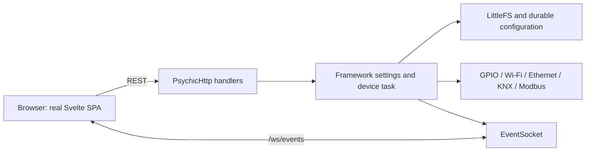
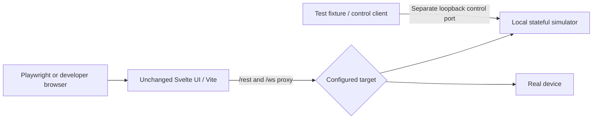
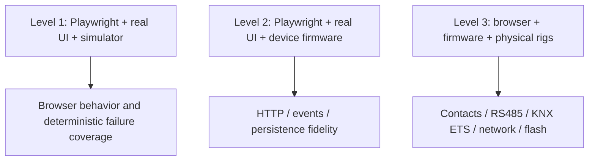

# Hardware-independent frontend functional testing plan

## 1. Scope, baseline, and delivery status

Analysis baseline: local `dev`, commit `fd848362c0070957ca9db165865dfa23442d1ae8`, inspected 2026-09-27. This document implements the analysis-and-plan deliverable in the supplied task. No simulator, firmware change, production UI change, or new test runner is implemented by this deliverable. Findings below are source inspection results, not claims of browser or hardware validation.

Labels used throughout: **Existing** means confirmed in this checkout; **Required change** means development configuration needed for the proposed workflow; **Proposed** means new simulator/test infrastructure; **Optional** means a separately scoped improvement. Commands for new scripts are acceptance targets, not commands available today.

Recommendation: run the real Svelte frontend against a standalone, stateful HTTP/WebSocket service. Preserve the current polling and event mechanisms, response shapes, authentication failures, and build profiles. Use Playwright for browser coverage, protocol-level contract tests for fidelity, and real hardware for integration and physical behavior. Browser-only here means no physical device; a local Node service is still required.

## 2. Existing architecture and evidence map

Repository-relative paths below identify the implementation authority. C++ serializers and handlers take precedence over TypeScript declarations where they differ.

| Concern | Source and confirmed behavior |
| --- | --- |
| UI/build | `interface/package.json`: Svelte 5, SvelteKit 2, TypeScript, Vite 5, Tailwind 4, DaisyUI 5, Chart.js, msgpack-lite. Existing scripts: dev, build, preview, check, lint, format; no Playwright runner. Exact installed versions belong to package-lock.json. |
| Browser execution | `interface/src/routes/+layout.ts`: SSR and prerender disabled, initial GET features; app metadata includes a GitHub repository string. Components call relative REST URLs directly; there is no shared universal API client. |
| Static bundle | `interface/svelte.config.js`: adapter-static outputs build/, index.html fallback, single bundle strategy. `vite-plugin-littlefs.ts` removes hash segments for LittleFS filename limits. |
| Device packaging | `scripts/build_interface.py`: npm install/build, gzip into `data/www` for LittleFS or generated `lib/framework/WWWData.h` for EMBED_WWW. `platformio.ini` registers the prebuild hook. Do not edit generated WWWData.h. |
| Serving | `lib/framework/ESP32SvelteKit.cpp`: PsychicHttp port 80, embedded asset handlers/default index or filesystem assets/index fallback. Deep links depend on that fallback. |
| Desktop proxy | `interface/vite.config.ts`: /rest → http://192.0.2.10 and /ws → ws://192.0.2.10, changeOrigin, WebSocket upgrade enabled. Comments mention a different obsolete IP. |
| Shared UI state | `lib/stores/user.ts` persists username/admin/bearer_token in localStorage key user. socket.ts owns connection/subscriptions; telemetry.ts, analytics.ts, battery.ts hold live data/history. Device page owns config/status/KNX, dirty/busy/offline state locally. |
| Actuator | `src/device/ActuatorApi.cpp`: authenticated GETs and queued POSTs; queue capacity eight in Actuator.cpp. `DeviceConfig.cpp` validates complete profiles; Actuator.cpp owns relay state, timers, protocol transitions, durable writes and reset. |
| Protocol Interface | `src/protocols/KnxAdapter.cpp`, `Modbus.cpp`, `ModbusPdu.h`; `src/generated/KnxProduct.h` supplies KNX product definitions. |
| Framework | `lib/framework/*Service.{h,cpp}`, *Status.cpp, HttpEndpoint.h, EventEndpoint.h, FSPersistence.h, SecurityManager.h. State serializers often reside in headers. |
| Existing tests | `tests/native_tests.cpp`, `tests/network_tests.cpp`, `tests/product_contract_test.py`; retain these as independent firmware evidence, not browser coverage. |
| Existing CI | `.github/workflows/ci.yaml` deploys MkDocs on main/master pushes; it is not frontend CI and does not cover dev PRs. |



### Build profiles must remain distinct

`src/main.cpp` selects Actuator under ACTUATOR_BOARD; otherwise it starts LightStateService and LightMqttSettingsService. `waveshare-relay-6ch` sets ACTUATOR_BOARD and disables sleep; it excludes the two light services. Base firmware excludes device/protocol sources. `features.ini` enables security, MQTT, NTP, upload/download, analytics, coredump and base sleep; battery is disabled. Ethernet is board-specific, not generally enabled on the six-relay target. EVENT_USE_JSON defaults to 0 in Features.h.

The feature response does **not** declare an actuator/demo discriminator. The menu always links to `/device`; the home page redirects to `/device`; `/demo` remains an explicit template-only route. MQTTConfig consumes brokerSettings even though that service is excluded from actuator firmware. Simulate these profiles faithfully and record unsupported-route behavior; do not silently enable demo APIs on the actuator profile. A feature discriminator and UI gating are optional production improvements requiring a separate change.

### End-to-end dependency traces

| Frontend action | Transport/handler | State and external effect |
| --- | --- | --- |
| Device Outputs toggle/pulse | device/+page.svelte api → POST device/commands → Actuator::endpoint/execute | Permission mask, enabled/block check → Actuator::relay → GPIO and KNX status. UI calls refresh and continues 2-second polling. |
| Apply profile/protocol | POST device/config → Config::parse → Actuator::apply | Revision check; stop old bus, start candidate, persist; rollback on start/write failure. |
| KNX commissioning | GET/POST knx/config → KnxAdapter::snapshot/configure | ETS ownership/busy/revision checks → group/object/parameter tables and durable KNX image. |
| Programming toggle | POST knx/programming → Actuator::programming | Requires KNX mode and IPv4 uplink; same state as hardware gesture. |
| Wi-Fi edit | Wifi.svelte → wifiSettings → HttpEndpoint + WiFiSettingsService | Persist profile, delayed reconnect; reconnect/rssi events and updated status. |
| Template LED | Demo.svelte → lightState or led event → LightStateService/EventEndpoint | LED GPIO and state propagation to other clients. |
| Firmware upload | UploadFirmware.svelte → multipart uploadFirmware → UploadFirmwareService | Flash Update; otastatus events, response/error and eventual restart. |

Pure navigation, validation, dirty-state editing, dialogs, charts and responsive layout already run in a desktop browser. Firmware handlers themselves depend on ESP32 libraries and cannot simply be launched as a desktop server. All browser-consumed device routes need simulation, although some simulated endpoints (features, auth, settings) require no physical model beyond state/storage.

## 3. REST contract inventory

All paths in the following tables are prefixed `/rest/`. GET has no body. JSON POSTs use application/json except firmware upload. **U** = authenticated user; **A** = admin; **I** = admin or installer; **C** = admin/installer/operator. Framework wrappers return **401 for both unauthenticated and insufficient-role requests**, whereas actuator handlers distinguish 401 and 403. Preserve this difference. Empty HTTP replies must not be replaced by invented JSON envelopes.

### Framework interfaces consumed by the frontend

Payload names refer to the exact field dictionary below and `interface/src/lib/types/models.ts`. Backend names are under lib/framework unless stated otherwise.

| Path | Method / auth | Request → success response | Frontend caller | Backend / modified state / dependency / errors |
| --- | --- | --- | --- | --- |
| features | GET / public | none → Features | routes/+layout.ts | FeaturesService::createJSON; build flags, no mutation. |
| signIn | POST / public | {username,password} → {access_token} | routes/login.svelte | AuthenticationService; JWT session; invalid input/credentials 401. |
| verifyAuthorization | GET / U | none → empty 200 | +layout.svelte, user/+page.svelte | AuthenticationService; no mutation; invalid token 401. |
| securitySettings | GET, POST / A | Security on POST → redacted Security | user/+page.svelte, EditUser.svelte | SecuritySettingsService + HttpEndpoint; users/signing secret persisted; invalid list 400; sessions revoked after edits. |
| wifiStatus | GET / U | none → WifiStatus | wifi/sta/Wifi.svelte | WiFiStatus::wifiStatus; radio/IP state; connection-dependent fields omitted. |
| wifiSettings | GET, POST / A | WifiSettings → normalized WifiSettings | wifi/sta/Wifi.svelte | WiFiSettingsService + HttpEndpoint; persisted station profiles and reconnect. |
| scanNetworks | GET / A | none → empty 202 | wifi/sta/Scan.svelte | WiFiScanner::scanNetworks; starts asynchronous RF scan. |
| listNetworks | GET / A | none → {networks: NetworkItem[]} or empty 202 | wifi/sta/Scan.svelte | WiFiScanner::listNetworks; pending scan triggers/resumes scan path; UI retries about once/second. |
| apStatus | GET / U | none → ApStatus | wifi/ap/Accesspoint.svelte | APStatus; AP state/client count. |
| apSettings | GET, POST / A | ApSettings → normalized ApSettings | wifi/ap/Accesspoint.svelte | APSettingsService + HttpEndpoint; persistent provisioning/AP configuration. |
| ethernetStatus | GET / U | none → EthernetStatus | ethernet/Ethernet.svelte | EthernetStatus; only registered with FT_ETHERNET; disconnected fields omitted. |
| ethernetSettings | GET, POST / A | EthernetSettings → normalized EthernetSettings | ethernet/Ethernet.svelte | EthernetSettingsService + HttpEndpoint; persistent hostname/IP settings; feature-gated. |
| mqttStatus | GET / U | none → MQTTStatus | connections/mqtt/MQTT.svelte | MqttStatus; broker connection/client/error state; FT_MQTT. |
| mqttSettings | GET, POST / A | MQTTSettings → normalized MQTTSettings | connections/mqtt/MQTT.svelte | MqttSettingsService + HttpEndpoint; saved connection settings and reconnect. |
| brokerSettings | GET, POST / A | BrokerSettings → BrokerSettings | connections/mqtt/MQTTConfig.svelte | src/LightMqttSettingsService; template-only discovery settings/persistence. |
| ntpStatus | GET / U | none → NTPStatus | connections/ntp/NTP.svelte | NTPStatus; clock/server/uptime; FT_NTP. |
| ntpSettings | GET, POST / A | NTPSettings → NTPSettings | connections/ntp/NTP.svelte | NTPSettingsService + HttpEndpoint; saved time server/timezone. |
| systemStatus | GET / U | none → SystemInformation plus network | system/status/SystemStatus.svelte | SystemStatus::systemStatus; ESP memory/flash/reset/runtime and uplink; no mutation. |
| restart | POST / A | no required body → empty 200 | system/status/SystemStatus.svelte | RestartService; reply before restart, sockets drop. |
| factoryReset | POST / A | no required body → empty 200 | system/status/SystemStatus.svelte | FactoryResetService; actuator reset callback when installed, otherwise clear config and restart. No ERASE payload on this framework route. |
| sleep | POST / U | no required body → empty 200 | statusbar.svelte, SystemStatus.svelte | SleepService; FT_SLEEP; absent on actuator build. |
| uploadFirmware | POST / A | multipart field file (.md5 or .bin) → {md5} for hash, empty 200 for binary | system/update/UploadFirmware.svelte | UploadFirmwareService; MD5 staging/flash/restart; 400,403,406,413,422,500,503,507 depending on failure. |
| downloadUpdate | POST / A | {download_url} → empty 200 | GithubFirmwareManager.svelte, UpdateIndicator.svelte | DownloadFirmwareService; creates update task, emits OTA, flash/restart; nonobject 400, task creation 500. |
| coreDump | GET / U | none → application/octet-stream bytes | system/coredump/+page.svelte | CoreDump::coreDump; flash read; unavailable 500 {status:"error",message:"core dump not available"}. |
| lightState | GET, POST / U | {led_on:boolean} → same shape | demo/Demo.svelte | src/LightStateService; template only; GPIO, led event, HttpEndpoint semantics. |

For HttpEndpoint settings routes, nonobject bodies or updater ERROR return 400; successful POST returns the serializer's state, not `{ok:true}`. Missing fields can default or normalize under individual updater rules: do not impose the actuator's strict whole-object schema on framework settings. Feature-disabled route behavior must be checked against the firmware fallback, which can return SPA HTML rather than a JSON 404.

### Field dictionary

These are wire fields, not a proposal to rename the APIs. Optionality follows backend serializers rather than TypeScript's sometimes stronger types.

| Payload | Fields |
| --- | --- |
| Features | security, mqtt, ntp, upload_firmware, download_firmware, sleep, battery, analytics, coredump, event_use_json, ethernet booleans; firmware_version, firmware_name, firmware_built_target strings; any registered user features. No built-in ota or actuator flag. |
| Security | jwt_secret:string, users:[{username,password,admin:boolean,role,channels:number}]. GET and POST response blank passwords and secret. |
| WifiSettings | hostname:string, connection_mode:number, wifi_networks:[{ssid,password,static_ip_config:boolean,local_ip?,subnet_mask?,gateway_ip?,dns_ip_1?,dns_ip_2?}]. Array order matters. |
| WifiStatus | status:number; when connected local_ip,mac_address,rssi,ssid,bssid,channel,subnet_mask,gateway_ip; DNS fields when available. |
| NetworkItem | rssi:number, ssid:string, bssid:string, channel:number, encryption_type:number. |
| ApSettings / ApStatus | settings: provision_mode,ssid,password,channel,ssid_hidden,max_clients,local_ip,gateway_ip,subnet_mask; status: status,ip_address,mac_address,station_num. |
| EthernetSettings / EthernetStatus | settings: hostname,static_ip_config, optional local_ip/subnet_mask/gateway_ip/dns_ip_1/dns_ip_2; status: connected, then connected-only address fields and link_speed, optional DNS. |
| MQTTSettings / MQTTStatus | settings: enabled,uri,username,password,client_id,keep_alive,clean_session,message_interval_ms; status: enabled,connected,client_id,last_error. |
| BrokerSettings | mqtt_path,name,unique_id,status_topic. |
| NTPSettings / NTPStatus | settings: enabled,server,tz_label,tz_format; status: status,utc_time,local_time,server,uptime. |
| Analytics | max_alloc_heap,free_heap,used_heap,total_heap,min_free_heap,core_temp,fs_total,fs_used,uptime; psram_size/free_psram/used_psram only when PSRAM exists. |
| SystemInformation | Analytics plus esp_platform,firmware_version,cpu_freq_mhz,cpu_type,cpu_rev,cpu_cores,sketch_size,free_sketch_space,sdk_version,arduino_version,flash_chip_size,flash_chip_speed,cpu_reset_reason; backend also emits network:{online,interface,ip}, absent from UI type. |

### Actuator interfaces

All below use `src/device/ActuatorApi.cpp` endpoint/execute. Current browser caller is `routes/device/+page.svelte`, except protocol/transition which is backend-only. All registered actuator paths have a GET handler; commands, programming and transition GETs fall through to a status snapshot, though the UI does not use those GETs.

| Path | Method/auth | Request and response | State/error behavior |
| --- | --- | --- | --- |
| device/status | GET / U | Status + capabilities | Snapshot only. UI polls every 2 seconds; no POST registered. |
| device/config | GET / U; POST / I | GET Config + capabilities; POST complete Config → Result | Parse 422; stale revision, protocol start or persistence failure 409; successful apply increments revision and persists. |
| device/commands | POST / C | command object below → Result, except factory_reset {ok:true} | Role/channel checks 403, malformed command arguments 422, disabled/blocked relay 409. |
| protocol/transition | POST / I | {mode,revision,requestId?} → Result | Copies current profile and replaces mode/revision, then same parse/apply logic. Not used by current UI: selection saves device/config. |
| knx/config | GET / U; POST / I | GET Knx + capabilities; POST commissioning snapshot plus takeover → Result | Wrong mode, inactive/busy, stale KNX revision, invalid mappings, ownership or commit failure return 409. |
| knx/programming | POST / I | {active:boolean,requestId?} → Result | Wrong mode/no uplink 409; nonboolean active 422; runtime programming state changes. |

Result is `{ok:boolean,error:string,revision:number}`; revision here is **actuator config revision**, including responses to KNX requests. GET KNX revision is separate. Early validation replies can be bodyless: auth 401, role 403, nonobject or measured JSON >8192 bytes 400, full request queue 503. requestId >64 characters returns 422 `{error:"requestId too long"}`. Sixteen completed entries deduplicate per user for 60 seconds using path plus serialized payload; identical retry returns prior result, different payload same ID returns 409 `{error:"requestId reused with different payload"}`. Preserve wire distinctions and test key-order behavior through captured serialization vectors.

Config fields are in `interface/src/lib/device/types.ts` and DeviceConfig::write/parse:

* schemaVersion=1, revision unsigned; exactly six relays and three clicks.
* Relay: name string up to 32 characters, enabled/startup/disconnectOff booleans, pulseMs integer 10–60000, timeout integer 1–3600 seconds.
* rgb,buzzer,button,rs485,busIndicators,busWatchdog booleans; brightness 0–100; unit 1–247; baud **index** 0–4 representing 9600/19200/38400/57600/115200; serialFormat index 0–3 for 8E1/8O1/8N2/8N1; tcpPort 1–65535 except 80; busMask 0–63; tcpAllow empty or IPv4.
* mode is exactly off/modbus_rtu/modbus_tcp/knx_ip. RTU requires rs485. Only one protocol owns transport resources at a time.
* clicks entries contain action 0–8 and target 0–6. Actions 1–4 require an enabled relay target numbered **1–6**; other actions require target 0. Relay commands use **zero-based** channels.

Status fields: revision,mode,protocolState,fault,error,sta,networkOnline,networkInterface,ip,ap,apClients,uptime; six relays `{on,enabled,blocked,source}`; programming,knxConfigured,pressed,lastGesture,gestureCount,resetArmed,color:number[3],toneHz,requests,frameErrors,rejected,configWindow,tcpClients,audit:string[]. Backend adds rgbEnabled,buzzerEnabled,buttonEnabled,rs485Enabled not declared in UI Status. GET adds capabilities `{configure,command,admin,channels}`; admin mask is 63, others use stored mask. Firmware `device.state` events do not add these per-user capabilities.

Knx fields: revision,address,owner,configured,active,busy,developmentIdentity,objects:[{number,groups:string[]}],parameters:[{enabled,startup,disconnectOff,timeout,pulseMs}]. active is programming state, not simply protocol-running. Exactly 18 ordered objects numbered 1–18 and six parameters. For each channel, object sequence is Switch, Block, Status. Individual address area/line 0–15, device 1–255. Groups use a/b/c (0–31/0–7/0–255), excluding 0/0/0 and duplicates within an object; max eight per object, 64 unique addresses, 96 associations. First group is sending address. ETS ownership requires explicit takeover; busy state forbids edits. Commissioned relay parameters cannot be changed through device/config while staying in KNX mode.

| Command | Extra fields / effect |
| --- | --- |
| relay / pulse | channel:0–5; relay requires value:boolean; pulse uses configured duration. |
| all_off | No extras; rejects whole operation 403 if any enabled relay is blocked or outside caller mask. |
| unblock | Installer/admin; channel:0–5. |
| rgb | red,green,blue integers 0–255; brightness 0–100 (default 10), seconds 1–30 (default 5); rgb must be enabled. |
| identify | Five-second indication. |
| tone | hz 500–4000 (default 2000), ms 10–2000 (100), duty 1–50 (25); buzzer enabled. |
| acknowledge | Clears tone/timer. |
| modbus_window | Installer/admin; seconds 0–300 (60), peer string default rtu; UI opens 60 seconds. |
| factory_reset | Admin plus confirm:"ERASE"; safe reset and restart. |

Unknown or unauthorized commands return 403. All command requests from the UI include requestId; profile and commissioning saves currently do not.

### Other/external interfaces

Backend-only `/rest/time` POST `{local_time}` (admin, 200/400) and `/rest/generateToken` GET (admin, username query, `{token}`/401) have no current frontend fetch caller. Keep them in an extended contract suite, not the required UI coverage count. LightStateService declares a separate light WebSocket object, but begin() does not start it; do not invent a live frontend dependency on it.

`GithubFirmwareManager.svelte` fetches `https://api.github.com/repos/<page.data.github>/releases`; UpdateIndicator fetches `/releases/latest`. These are external GitHub APIs, not firmware REST. For deterministic Level 1, intercept only these external requests with release fixtures including assets, tags, prerelease and failure responses. Device APIs must still use the real simulator transport. The simulator must never fetch download_url or flash a binary.

## 4. WebSocket/event contract

`+layout.svelte` connects to same-origin `/ws/events?access_token=<JWT>` when security is enabled, using ws/wss according to page protocol. EventSocket authenticates the upgrade as U. There is no separate event-source/SSE dependency in the inspected frontend.

Envelope is `{event:string,data:...}`. Default transport is binary MessagePack; EVENT_USE_JSON builds use JSON text, signaled by features.event_use_json. Browser sends `{event:"subscribe",data:"rssi"}` and equivalent unsubscribe. Firmware accepts only registered event names, incoming updates need object data, and frames over 8192 bytes fail. Track subscriptions per connection. Emit only to subscribers. EventEndpoint sends an initial snapshot to a subscribing client and excludes the update origin on broadcasts.

| Event | Direction, data | Producer / consumer / timing |
| --- | --- | --- |
| rssi | server → client {rssi,ssid} | WiFiSettingsService → layout/telemetry; 500ms interval, disconnected SSID sentinel. |
| ethernet | server → client {connected} | EthernetSettingsService → layout/telemetry; feature-dependent, 500ms constant. |
| analytics | server → client Analytics | AnalyticsService → analytics store/charts; 2000ms, optional PSRAM fields. |
| battery | server → client {soc,charging} | BatteryService → battery store; feature/hardware-dependent. |
| notification | server → client {type,message} | NotificationService → layout/toasts; type error/warning/info/success. |
| otastatus | server → client {status,progress?,bytes_written?,total_bytes?,error?} | Upload/DownloadFirmwareService → telemetry, FirmwareUpdateDialog; preparing/progress/finished/error. UI initial state also uses none. Fields vary by stage despite stricter UI type. |
| led | bidirectional {led_on:boolean} | Template LightStateService/EventEndpoint ↔ Demo; subscription snapshot, subsequent updates. |
| device.state | server → client Status without capabilities | Actuator loop every 1000ms; registered but **not subscribed to by current device page**. Test at contract level; backend-originated relay changes reach current UI by REST polling. |
| reconnect | server → client {delay_ms} | WiFiSettingsService before delayed reconnect; no current layout listener. |
| features | server → client Features | FeaturesService subscription/change emission; current layout loads REST instead of subscribing. |

socket.ts retries after 1000ms and resubscribes listener names on open. The unresponsive timer is armed/reset by received messages, then disconnects after 2000ms silence; it is **not** armed immediately on open. There is no application ping/pong contract. Steady simulated rssi traffic prevents false reconnects. Browser-side open/close/error/message/unresponsive callbacks are not firmware event names.

Potential defects to characterize, not silently fix: unsubscribe checks set size before deleting a listener; listener names may remain and resubscribe, the layout does not remove every listener it adds, repeated reconnect triggers can race, and captured socketUrl can retain an invalid token until reinitialization. Test navigation churn and token revocation against observed behavior; any fix is a separate production change.

## 5. Authentication, persistence, and hardware boundary

JWT includes username, admin, boot and monotonic issued time. SecuritySettingsService validates current user, signature, matching boot and age <8 hours; reboot invalidates sessions. Administrative user edits rotate signing secret. Browser decodes username/admin but device role and channel permissions come from backend capabilities. A role string alone must not grant the admin boolean privilege. New simulator sessions should use real signed, jwt-decode-compatible tokens with simulator-only credentials and clock/boot validation.

Security update constraints: at most 16 users, unique usernames length 3–32, channels 0–63, roles viewer/operator/installer/administrator, at least one admin. Blank password preserves an existing user's password; responses redact passwords and jwt_secret. Firmware stores PBKDF2 hashes; simulator need not emulate device CPU cost but must preserve observable login/update/revocation semantics.

Framework settings persist under `/config/{wifiSettings,apSettings,ethernetSettings,mqttSettings,ntpSettings,securitySettings}.json`; template broker settings use `/config/brokerSettings.json`. Actuator uses DurableStore with logical `/config/actuator`; KNX adapter persists its image/revision/owner under logical `/config/knx`. Factory reset also clears commissioning and uses reset recovery handling. Do not model a reboot as resetting all configuration. Browser refresh preserves localStorage credentials but reloads server state; unsaved page-local edits are not persistent settings.

Hardware simulations represent commanded state, not physical relay contact feedback (the UI explicitly says the board does not measure contacts). Simulate RF/link/IP state, default IPv4 uplink, timers and resulting protocol interface status. `NetworkSupport.h` excludes provisioning AP from uplinks: AP clients alone must not enable KNX or Modbus TCP. Loss timeout behavior differs: RTU watchdog uses lastBus; TCP/KNX use network-loss time. Changing default uplink/IP restarts network protocols. Actual Ethernet PHY, RS485 timing, KNX/ETS interoperability, flash reliability, buzzer waveform and power-loss safety belong to Level 3.

## 6. Proposed local development architecture



**Required change:** parameterize Vite's two proxy targets through server-side configuration. DEVICE_HOST accepts a host/IP with optional port, normalizes to http:// when scheme is absent; explicit http/https origins map to ws/wss. Validate origins and reject paths/credentials. Do not expose credentials in VITE_* variables. Keep relative frontend URLs and all existing build plugins/output settings. Production bundle needs neither a simulator hostname nor conditional mock imports.

**Proposed scripts**, from interface/:

```text
npm ci
npm run dev:sim                  # launch simulator, wait for readiness, launch Vite
npm run dev:device               # require DEVICE_HOST; launch only Vite
npm run test:sim                 # simulator contract/unit tests
npm run test:e2e                 # Playwright owns simulator and Vite lifecycle
npm run test:e2e:device          # explicit device target, non-destructive default
```

PowerShell: `$env:DEVICE_HOST='192.0.2.10'` then `npm run dev:device`. POSIX: `DEVICE_HOST=192.0.2.10 npm run dev:device`. Implement orchestration as a Node script rather than shell-specific environment assignments. Make npm run dev honor DEVICE_HOST too; document migration from hard-coded default. Never silently fall back to real hardware when simulator startup fails. Use strict ports and readiness checks. Provide an additional built-SPA smoke server with index fallback and the same proxies; do not assume unconfigured vite preview handles API routing correctly.

## 7. Proposed simulator modules and state model

Use a separate `interface/simulator/` package boundary within the frontend tooling, excluded from src/ and production imports. Node HTTP plus a WebSocket library is sufficient; multipart parsing and JWT signing require maintained libraries, pinned through the lockfile when implemented. Reuse msgpack-lite for wire encoding. Do not port ESP32 RTOS, PHY or KNX stacks merely to reproduce browser state.

| Module | Responsibility |
| --- | --- |
| server.ts, routes/framework.ts, routes/actuator.ts | Production-path dispatch, auth predicates, body limits, serializers, precise status/content types. |
| state.ts, clock.ts | One virtual device, serialized state mutations, deterministic monotonic timers and audit; wall-time runtime with explicit advance for contract tests. |
| models/actuator.ts, knx.ts, network.ts | Command/config transitions, independent revisions, single protocol, uplink and backend-originated effects. |
| auth.ts, persistence.ts | Users/session epoch, token validation; atomic JSON persistence in simulator-specific directory. |
| events.ts, ota.ts | Per-client subscriptions, codec, periodic broadcasts, upload/download timelines and faults. |
| profiles/, fixtures/ | Actuator-default, commissioned-KNX, template, Ethernet-enabled and optional battery/security-off profiles; source provenance. |
| control.ts, faults.ts | Separate loopback control server, scenario/reset/clock and next-request fault rules. |

State partitions:

* Persistent: profile identifier/schema, framework settings/users, actuator Config, KNX commissioning image-equivalent data/owner/revision. Optional disk mode for developers; isolated temporary file directory for tests.
* Volatile: boot ID/time, issued sessions, six outputs/blocks/sources/pulse deadlines, RGB/tone deadlines, gesture/reset state, selected protocol/status/fault, bus counters/window/clients, network links/default route/AP clients, scan progress, OTA/MD5, audit ring and request dedup ring.
* Transport/control: subscriptions, latency/error rules and scheduled disconnects. Never serialize these into production configuration responses.

Initialize actuator defaults from DeviceConfig.h: revision 1, six enabled Channel 1–6 relays initially off, pulse 1000ms, timeout 30s, disconnectOff false; rgb/buzzer/button/rs485 true, brightness 10, clicks (0,0)/(6,0)/(8,0), mode off, unit 1, baud index 1, format 0, TCP 502, mask 63, busIndicators/watchdog false, empty allowlist.

Every mutation follows validate → authorize → transition → durable commit → response/events, except ordering explicitly different in firmware (for example reply-before-restart). Implement protocol-start and persistence rollback. Device-originated control operations use the same model transitions as web operations with the appropriate source/mask semantics, not a second independent state store. KNX Switch/Block operations affect relay status and blocking; Modbus effects update counters/relay state through their policy checks. Simulated telegram injection represents decoded application effects, not full KNXnet/IP packets.

Avoid duplicated rule drift by storing firmware-derived valid/invalid request vectors and expected responses under contracts/. Annotate each with source symbol and baseline commit. Types may be imported type-only from lib/device/types and lib/types/models but require wire refinements for omitted/extra fields. Firmware behavior remains authoritative; do not generate firmware rules from the simulator. Existing native tests can supply boundary cases without a production refactor.

## 8. Proposed control API, scenarios and fault injection

Use a separate loopback port (for example API 3080, control 3081). Control paths below are **new simulator-only interfaces**, never forwarded by /rest or included in firmware. Require a per-run control token; bind localhost, and make reset/fault endpoints unavailable in real-device mode. A dashboard is optional after the control API is stable.

| Proposed control operation | Purpose |
| --- | --- |
| GET /__sim/health, GET /__sim/state | Readiness/profile/commit and redacted model inspection. |
| POST /__sim/reset {profile} | Deterministic test reset: clear timers/faults/subscriptions/state, reseed; differs from production factory reset. |
| POST /__sim/actions {type,...} | relay, network, gesture, knx-object, ETS-busy/owner, modbus-effect, reboot, factory-reset, telemetry and OTA outcomes. |
| POST /__sim/faults {method,path,effect,count,...} | Exact route fault selection: latency, HTTP status/body, malformed body, held response, connection reset, persistence/protocol failure. |
| POST /__sim/socket {action,...} | Close clients, refuse upgrades, pause periodic frames, send malformed frame; keep control service available. |
| POST /__sim/clock {advanceMs} | Advance logical device time and drain due model actions; browser's real polling remains independently observable. |

Required reusable scenarios: normal online; booting/API unavailable then ready; REST-only failure; socket-only outage; total API offline while control remains reachable; Wi-Fi loss with Ethernet fallback; Ethernet loss; AP-only; stale revision; blocked/disabled/unauthorized relay; KNX uncommissioned/ETS-owned/busy/programming; RTU watchdog and KNX/TCP network loss; persistence failure and protocol rollback; user/token revocation; factory defaults; OTA progress/error/restart.

Faults are deterministic, bounded and reset between tests. Timeouts must distinguish a held response from immediate network rejection. Current fetch code has no explicit AbortController deadline; a held request can leave busy/loading indefinitely. Characterize this as a product limitation, use bounded test observation and release the held request in teardown. Do not claim timeout recovery exists or add it invisibly in simulator mode. Record response bodies, event ordering and request IDs without passwords/tokens.

## 9. Playwright architecture and functional matrix

**Proposed:** Playwright owns service lifecycle/readiness via webServer; start with workers=1 and no reuse in CI because there is one mutable virtual device. Independent browser projects must not share concurrently mutated state. Later parallelization requires a complete API/control/Vite port set and state directory per worker. Fresh context and profile reset before each test; login through UI for auth tests and a verified fixture for unrelated tests. Reboot/security changes invalidate saved auth fixtures.

Use real DOM clicks/forms with role/label locators, actual API requests and real socket frames. Assert both visible results and simulator state for writes. Wait on relevant response and eventual UI state rather than networkidle (polling never settles) or arbitrary sleeps. For actuator external changes allow at least one 2-second poll plus bounded scheduling margin. Capture console/page errors, request failures, screenshots and traces on failure. Only external GitHub is intercepted. Use Chromium initially, then Firefox/WebKit with the same contract/profile set and a mobile viewport project. Official references: [Playwright webServer](https://playwright.dev/docs/test-webserver), [Playwright CI](https://playwright.dev/docs/ci).

Level notation: **1** browser + simulator, **2** browser + real firmware, **3** physical verification. Every row is proposed coverage, not an existing passing test. Rows with faults unsupported by a live device stay Level 1; Level 2 compares normal responses/selected safe failures. For every configurable form, include initial loading, changed/unchanged save, cancel/discard where present, validation, permission denial, request failure and reload persistence.

| ID | Surface / setup and action | Required observable assertions | Levels |
| --- | --- | --- | --- |
| NAV-01 | Startup, login, home; every menu link and direct deep link | Features load, app renders, correct gated menus, fallback/redirect/error behavior | 1,2 |
| NAV-02 | Toggle all feature profiles, template vs actuator | Disabled features hidden where implemented; unsupported demo/broker/device links logged as defects, not faked success | 1,2 |
| AUTH-01 | Valid/invalid login, logout, refresh, malformed/stale localStorage | Correct session persistence/invalidation, invalid login feedback; characterize malformed storage failure | 1,2 |
| AUTH-02 | Viewer/operator/installer/admin and masks 0/1/63 | Configure/command visibility, channel disablement, backend denial even when requests bypass UI | 1,2 |
| AUTH-03 | Expire token, reboot, change users/secret | REST denies stale session; reconnect uses valid session after login; UI response recorded | 1,2 |
| USER-01 | Add/edit/delete users, role/mask/password | Redacted response, blank password preservation, duplicate/invalid username and last-admin rejection, reauthentication after save | 1,2 |
| OUT-01 | Toggle each relay; pulse; all off | Correct zero-based channel, on/source badge, pulse expiry, all-off atomic denial on mask/block | 1,2,3 contacts |
| OUT-02 | Disable/block relay then unblock as installer | Controls and backend agree; disabled output off; permission errors shown | 1,2 |
| OUT-03 | Control API sets external relay/KNX/Modbus state | Poll updates UI, proper source/block; no requirement for device.state subscription | 1,2,3 bus |
| CFG-01 | Edit six names/enabled/startup/pulse/loss policies; discard/apply | Dirty banner, discarded values, complete profile saved, revision increments, refresh/reboot preserves | 1,2,3 startup |
| CFG-02 | Two contexts save same revision; invalid bounds; injected write/start failure | 409/422 messages, no partial commit, previous protocol/profile retained | 1,2 safe cases |
| RGB-01 | Enable/disable, brightness, test color/time, identify | Command fields and current RGB, expiry/restoration, disabled rejection | 1,2,3 light |
| TONE-01 | Frequency/duration/duty bounds, silence, disable | toneHz state and bounded expiry/error, acknowledge clears | 1,2,3 sound |
| BTN-01 | Three click bindings and all nine action choices | Target rules, persistence, external gesture/count/pressed/resetArmed displays | 1,2,3 button |
| BUS-01 | Select off/RTU/TCP/KNX, save and reload | Exactly one mode, old transport stopped, waiting_network/run/failure; RS485-off forces UI mode off | 1,2,3 transport |
| MB-01 | Unit, baud index, format, port, allowlist, mask/indicator/watchdog flags | Serialized indices, invalid reserved port/IP rejection, persisted values, counters/clients displayed | 1,2,3 frames |
| MB-02 | Open/expire configuration window; device-originated bus writes and watchdog loss | Window indicator, request/error/rejected counters, masked effects and timeout off policy | 1,2,3 timing |
| KNX-01 | Select KNX + uplink, toggle programming; remove uplink | Active/status agreement, no-uplink 409; AP-only not uplink; gesture-origin toggle | 1,2,3 ETS |
| KNX-02 | Commission address/18 groups/six parameters | Validation and exact ordering; independent revision; reload/save; owner/takeover and busy interlock | 1,2,3 ETS |
| KNX-03 | Switch/block/status object effects; commissioned profile edit | Relay/source/block polling, forbidden profile edits, explicit takeover, commit rollback | 1,2,3 telegrams |
| WIFI-01 | Add/edit/delete/reorder profiles; DHCP/static fields and hostname/mode | Exact ordered payload, save/reload, connected/disconnected status and RSSI | 1,2,3 RF |
| WIFI-02 | Scan pending, results, empty, failure; select network, close/reopen modal | 202 handling, spinner/list/encryption display, polling cleanup and no duplicated intervals | 1,2 |
| AP-01 | Provision mode, SSID/password/channel/hidden/clients/address settings | Persisted fields, status/station count, validation/cancel and reconnect behavior | 1,2,3 AP |
| ETH-01 | Ethernet-enabled profile, DHCP/static edit and link loss | Feature gating, connected-only fields, status badge; selected-uplink/IP changes affect protocol | 1,2,3 PHY |
| MQTT-01 | Connection settings enable/save/failure; template broker settings | Saved payload, connection/error status, template discovery fields; actuator absent broker behavior | 1,2,3 broker |
| NTP-01 | Enable/server/timezone save, disabled/unsynced state | Status/time/server format, settings persistence and errors | 1,2,3 sync |
| SYS-01 | System status + analytics charts with/without PSRAM | Field formatting/history/units, no missing-field crash, telemetry updates | 1,2 |
| BAT-01 | Battery-enabled fixture, SOC/charging changes | Indicator/history and hidden UI when disabled | 1; 2,3 capable board |
| CORE-01 | Download coredump; unavailable response | Download bytes/type and error handling | 1,2 |
| OTA-01 | MD5 then BIN upload, cancel confirmation, wrong extension/size/target/hash | Multipart file field, MD5 status, preparing/progress/finished/error dialogs, file reset and reboot | 1,2 dedicated,3 flash |
| OTA-02 | Fixture GitHub releases/latest, prerelease/assets/errors; start download | Correct URL request, confirmation, OTA sequence; offline GitHub feedback | 1,2 dedicated |
| LIFE-01 | Cancel/confirm restart, sleep where enabled, both reset paths | Correct payload/permission, disconnect, boot/session invalidation, config retained for restart/cleared for reset | 1,2 dedicated,3 recovery |
| LIVE-01 | Device offline/online, REST failure/latency/malformed body/held response | Device warning/disabled controls on failed refresh; busy/loading outcomes; recovery after released fault; pending-request gaps recorded | 1 |
| WS-01 | JSON and MessagePack, subscribe/unsubscribe, multiple clients | Exact codec/envelope, no unsubscribed delivery, led origin exclusion, initial led snapshot | 1,2 contract |
| WS-02 | Close/reject/silence/reconnect and repeated route navigation | 1-second retry/resubscription, 2-second post-message silence path, no-frame initial limitation, duplicate/listener leak detection | 1,2 safe cases |
| DEMO-01 | Template LED HTTP and socket toggles from two clients | Both transports synchronize correct clients; actuator absence recorded | 1,2 template |
| UX-01 | Narrow/wide viewports, keyboard forms/dialogs, tab navigation, toast dismissal | Usable six-card grid, scrollable KNX table, focus/labels, no inaccessible controls or clipped actions | 1,2 smoke |
| REC-01 | Refresh deep link, restart simulator process with persisted state | Saved state restored, unsaved edits discarded, session invalidated on boot, history semantics recorded | 1,2 |

Known gaps should become tracked failing regression cases or explicit expected-failure tests with issue/reason. Never change simulator behavior solely to make these green. Distinguish simulator transport contract failures from frontend defects and actual hardware failures.

## 10. CI integration strategy

Add `.github/workflows/frontend-tests.yml`; leave docs deployment intact. Trigger pull_request and pushes including dev, with path filters for interface/, src/device/, src/protocols/, lib/framework/, features.ini, platformio.ini, contracts and test workflow changes. Use read-only repository permission, job timeout, cancel superseded runs. Pin a supported Node version and Playwright version during implementation; use package-lock and npm ci.

Proposed Linux job sequence (working-directory interface):

```text
npm ci
npm run check
npm run build
npm run test:sim
npx playwright install --with-deps chromium firefox webkit
npm run test:e2e
```

Playwright starts services itself after contract tests; readiness must check both API profile and frontend. Preserve logs, HTML/JUnit report, screenshots and traces on failure using an always-run artifact step; redact secrets. Start with one worker and all engines serialized, or separate CI engine jobs with independent processes. Run built-SPA/deep-link smoke as a second project. Add lint only after establishing the existing lint baseline; do not treat unrelated existing warnings as simulator regressions. Firmware packaging verification must compare the embedded/LittleFS process and ensure simulator/control/test files never enter the bundle. Existing native/Python tests remain separate checks.

## 11. Three testing levels and fidelity verification



Level 1 runs without device, broker or public network after installation, using explicit external-release fixtures. It proves frontend behavior against the extracted contract, not firmware conformance.

Level 2 uses the same browser specs tagged device-safe, targeting configurable Vite proxy or a device-hosted SPA URL. Default suite reads features/status/config and validates login, permissions and event codecs without changing network or flashing firmware. Mutating relay/config, reset, security, sleep and OTA tests require an explicitly selected disposable-device suite; restore fixtures where possible and record device identity/build/flags. Simulator control calls must throw in real-device mode, never become production URL requests.

Capture sanitized HTTP method/path/status/content-type/body and subscribed frames from both implementations for identical vectors. Normalize only volatile uptime, MAC/IP, build identifiers, session tokens and audit timestamps; never normalize error codes, omitted fields, revision changes, masks or ordering that affects behavior. Verify unauthorized wrappers, 202 scans, upload bytes, KNX separate revision and token invalidation. Record commit/profile/codec with each capture. Physical-device captures are outstanding evidence, not included in this document.

Level 3 release checklist: cold-boot safe outputs/startup policy and contact measurements; pulses and watchdog under load; RS485 unit/baud/parity, CRC and timing; TCP clients/allowlist/uplink failover; KNX ETS download, address/group interoperability, status feedback and reset commissioning; GPIO button multi-click/10-second recovery; RGB and buzzer electrical behavior; Wi-Fi/AP/Ethernet reconnect and default route; real OTA wrong-image/checksum/power-loss recovery; durable configuration corruption and interrupted factory reset. Use existing actuator/KNX/Modbus design and hardware documents for physical procedures. Level 1 must never be the release evidence for these claims.

## 12. Proposed file changes

```text
docs/FRONTEND_HARDWARE_INDEPENDENT_TEST_PLAN.md  # this delivered document
interface/vite.config.ts                       # configurable development proxies
interface/package.json + package-lock.json     # optional tooling scripts/dependencies
interface/.env.example                        # target/ports, no credentials
interface/scripts/dev.mjs                      # cross-platform process orchestration
interface/simulator/{server,state,clock,auth,persistence,events,ota,control,faults}.ts
interface/simulator/routes/{framework,actuator}.ts
interface/simulator/models/{actuator,knx,network}.ts
interface/simulator/{profiles,fixtures}/
interface/tests/contracts/                     # serializers, vectors, fidelity recordings
interface/tests/simulator/                     # state/transport/persistence tests
interface/tests/e2e/{fixtures,specs}/           # matrix cases and device-safe subset
interface/playwright.config.ts
.github/workflows/frontend-tests.yml
.gitignore                                    # sim state/auth/reports/traces
docs/frontend-testing.md                       # eventual runbook and limitations
```

No firmware edits are prerequisites. Any UI fixes revealed by tests belong in separately reviewed changes with both target modes checked. Optional future work: dashboard; shared API client with timeout/cancellation; socket lifecycle fixes; actuator feature flag and demo gating; per-worker parallel isolation; automated source-to-contract drift detection.

## 13. Phased implementation roadmap

Each phase is independently reviewable; phase numbers refer to future implementation. Phase 1's human-readable analysis is delivered here, while executable fixtures still need implementation.

| Phase / objective | Files and changes | Dependencies | Risk / mitigation | Acceptance and required checks |
| --- | --- | --- | --- | --- |
| 1 Contract baseline | This plan; tests/contracts wire shapes and source-derived vectors | dev baseline | Stale types / use C++ serializers | Every listed consumed route/event mapped; vector cases include omitted fields, auth codes, profile absence; manual inventory review |
| 2 Browser execution | vite.config.ts, scripts/dev.mjs, .env.example, package scripts | 1 | Wrong target / validate and fail closed | dev:device proxy forwards REST headers and WS query/upgrade; build output unchanged; configuration parsing tests |
| 3 Simulator foundation | server/state/clock/persistence/profiles/auth | 1,2 | State leakage / per-run directories and seeded reset | dev:sim launches and cleans up on Windows/Linux; features/login/verify work; reboot/persistence/session contract tests |
| 4 Framework REST | routes/framework, fixtures, multipart and settings serializers | 3 | Generic responses hide real errors / per-route vectors | All framework REST rows implemented for matching profile; GET/POST/redaction/202/binary/unauthorized tests |
| 5 Event transport | events.ts and WS contracts | 3,4 | JSON-only fake / test MessagePack default | Correct upgrade/auth/subscriptions/codecs/origin behavior, reconnect under normal telemetry; two-client tests |
| 6 Actuator model | models/actuator, routes/actuator, commands and durable transactions | 3,5 | Duplicated firmware rules / boundary vectors | Six relays, pulse/block/mask, revisions/idempotency, RGB/tone/gesture status; rollback and restart tests |
| 7 KNX/Modbus/network | models/knx/network, bus action controls | 6 | Implying stack emulation / explicit boundary | Mutual exclusion, uplink waiting, owner/busy/takeover, group limits/window/watchdog and state propagation tests |
| 8 Scenarios/faults | control/faults/ota, scenario fixtures | 4–7 | Flaky timers / deterministic scheduling | Every section 8 scenario reproducible and resettable; control unavailable on production API port; held-request teardown tested |
| 9 Full browser coverage | playwright config, fixtures/specs | 4–8 | Tests hide UI defects / no device API interception | Matrix IDs implemented with UI and state assertions; Chromium then Firefox/WebKit and responsive; known gaps explicitly tracked |
| 10 CI/build smoke | frontend-tests.yml, ignore rules, runbook | 9 | Optional tooling leaks into firmware / artifact inspection | Clean Linux run without hardware; reports on failure; production build/deep-link smoke and existing firmware checks |
| 11 Device fidelity | contracts captures, device-safe fixtures/spec tags | 9, real device | Destructive tests / explicit disposable suite | Actual captures compared by profile/commit; no unexplained wire differences; identical safe browser tests pass |
| 12 HIL/release | docs release procedures and rig results | 11, hardware/ETS/bus rig | False hardware confidence / independent measurements | Physical checklist in section 11 recorded with firmware version and failures resolved or release-blocked |

## 14. Risks, open evidence, and acceptance criteria

Primary risks are simulator drift, profile mismatches, overly strict inferred JSON schemas, conflating polling with events, shared mutable test state, and treating a browser pass as proof of physical behavior. Mitigations are source-linked vectors, separate profile fixtures, exact status/body/omission tests, transport-specific assertions, deterministic resets and Level 2/3 gates. Current event timeout and fetch limitations must remain visible. OTA progress, memory numbers and RF scans are synthetic; storage atomicity approximates firmware but does not prove flash recovery. A Node simulator cannot prove FreeRTOS queue timing or KNX stack correctness.

Outstanding verification: actual device payload captures, runtime unsupported-route fallback behavior by packaging mode, real socket upgrade failure response, cross-browser UI execution, CI timings, and hardware/ETS results. No physical device was used for this analysis. Framework settings defaults/normalization must use the existing corresponding header updaters and factory_settings.ini when creating fixtures; do not substitute universal client-side validation rules.

Plan-delivery acceptance: repository-specific architecture, REST/event inventories, hardware boundary, stateful design, full route/control matrix, CI and three-level strategy, file map and phase gates are present; no production behavior changed.

Future implementation acceptance:

1. A clean checkout can run dev:sim and interact with all implemented frontend surfaces without hardware; dev:device switches only configuration and uses the same UI.
2. Exact default MessagePack and optional JSON contracts, auth roles/masks, persisted settings, revisions, KNX ownership and asynchronous effects have executable coverage.
3. Every matrix ID has passing coverage, a feature-profile exclusion, or a documented product defect with rationale; unsupported features are never silently simulated as available.
4. Backend-originated changes, outage/recovery, bounded fault injection and deterministic isolation are repeatable in CI, with useful artifacts on failure.
5. npm check/build and established firmware build checks retain their baseline; simulator/control/test code is absent from deployed frontend/firmware artifacts.
6. Device-safe comparisons validate fidelity; destructive integration and physical release checks remain explicit independent gates.
