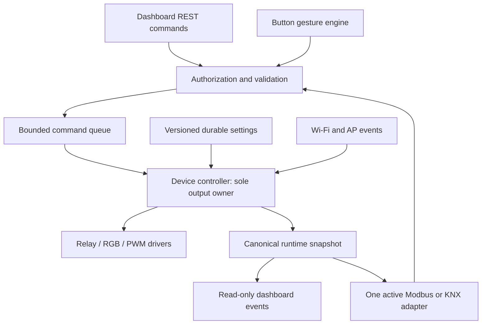

# Six-channel switching actuator production design

Implementation follow-up: [implemented behavior, build steps and qualification status](actuator-implementation.md).
Status: proposed implementation contract, 2026-09-26. Preserves the `dev` ESP32 SvelteKit framework. Firmware/UI implementation, hardware qualification and the ETS-importable product artifact remain future work. See [source review](actuator-source-review.md), [hardware reference](esp32-s3-relay-6ch-hardware.md), [Modbus contract](actuator-modbus-map.md) and [KNX contract](actuator-knx-design.md).

## Product decisions

The actuator has six independent outputs, configurable light/sound indication and local gestures. A single `protocolMode` enum is `off`, `modbus_rtu`, `modbus_tcp` or `knx_ip`; never use independent enable booleans that allow conflicting stacks. The management dashboard stays available in every mode. RTU is a server/slave and TCP is a server; client/master, gateway and KNX TP operation are outside this first product.

Default on first boot: all relays OFF, indicators enabled, button gestures enabled, fieldbus OFF, provisioning AP available. GPIO assignments are fixed. User commissioning selects the bus mode. MQTT remains a framework capability but application relay subscriptions default OFF; if enabled later, they pass through the same permission and ownership rules.

## Shared control architecture

New services follow existing `StatefulService<T>` conventions, with separate configuration and runtime types:

| Component | Ownership |
| --- | --- |
| `BoardProfile`, `RelayDriver`, `RgbDriver`, `BuzzerDriver`, `Rs485Port` | Pin constants and electrical access only |
| `HardwareSettingsService` | Enables, relay settings, indicator policy, gesture bindings |
| `DeviceController` | Serializes validated commands, relay state, locks, deadlines, state revision |
| `ButtonService` | Debounce, click classification and reserved factory-reset gesture |
| `IndicatorService` | Priority arbitration, nonblocking LED patterns and tone sequences |
| `ProtocolSettingsService`, `ProtocolSupervisor` | Saved profiles, exclusive lifecycle, rollback |
| `ModbusDataModel`, RTU/TCP adapters | One register contract shared by both transports |
| `KnxService`, `KnxCommissioningService` | Stack owner, group objects, address/parameter/table transactions |
| `ResetCoordinator`, `AuditService` | Safe reset and bounded operational audit |

One application task owns outputs and button timing (initial 5 ms scheduling target). One protocol task owns the selected stack and all its APIs. Network/HTTP callbacks enqueue requests; never sleep for LED patterns, tones, relay pulses or button holds. Protocol callbacks await bounded command completion before acknowledging accepted writes; a full queue returns busy, not success. Pass stack changes back to its owner task rather than calling the stack from HTTP callbacks.

Retain the framework networking task on its current core. Do not assume the framework loop cadence meets RTU framing or KNX service requirements. Measure latency and stack/heap margins under OTA, Wi-Fi reconnect and web traffic. Target command application below 50 ms under normal load and report overruns; this is an acceptance target, not a measured guarantee.

Every command carries origin, authenticated principal or fieldbus policy, request ID, expected config revision where relevant, and mode generation. Reject stale commands from a previous protocol generation. Order normal commands by queue acceptance; disabled channels and channel locks override ordinary commands. Factory reset/output shutdown takes precedence. Publish only applied state and explicit rejected-command results. Never call a commanded state a measured contact state.

## Configuration and persistence

Use a versioned JSON model with `schemaVersion`, `revision`, `hardware`, `indicators`, `button`, `protocol` and `access`. Six relay records contain `enabled`, `name`, `startupState` (OFF/ON), `disconnectPolicy` (hold/OFF), `disconnectDelayMs` and `pulseMs`. Defaults: OFF startup, hold during link loss; sites can choose OFF on timeout. Do not restore last state by default or write flash for each switch.

Each peripheral exposes `supported`, `enabled`, `available`, `effectiveState`, `lastError` and `lastChanged`. Separate saved settings, pending settings and effective runtime status. Disabling a relay immediately drives it OFF and rejects subsequent commands. Disabling RGB sends black; disabling buzzer cancels tones and PWM. Disabling button application actions suppresses clicks but preserves factory reset. Disabling RS485 while RTU is selected performs an explicit transition to `off`; UI previews that consequence. Disabling RGB/button also disables their KNX programming presentation/input while web programming remains available.

Validate the full candidate before mutation. Save a new generation with checksum, close/read back, then atomically select it with a manifest; retain the previous valid generation. Test the actual filesystem's power-loss behavior. KNX table images and JSON configuration share a generation reference so they cannot become mismatched after reboot. Settings edits use compare-and-swap revision checks; return conflict rather than overwrite another installer. Persist configuration on explicit Apply, with rate limiting. Runtime counters remain in RAM unless a bounded diagnostic checkpoint is requested.

## Relay and indicator behavior

Expose six channel cards with commanded ON/OFF, enabled/disabled, locked, command source, startup policy and errors. Each has ON, OFF and optional pulse commands. Bulk changes are validated as a group before any GPIO write; application atomicity does not mean simultaneous mechanical contact movement. Disabled channels in a bulk request cause rejection of the whole request. No ordinary command can bypass a KNX channel block. Administrative lock clearing is explicit and audited.

Disconnect policy applies to loss of STA IP for TCP/KNX; ordinary absence of KNX multicast telegrams is not proof of a failed bus. For RTU, an optional commissioned communications watchdog uses time since the last valid addressed request, with the channel timeout as its threshold; it defaults disabled because polling frequency is installation-specific. Losing a browser or closing one TCP client does not by itself force outputs OFF.

LED policy below is proposed and customizable by installer, including brightness (default 10%) and disabling individual indications. All patterns are timer-driven.

| State | Default RGB | Default buzzer |
| --- | --- | --- |
| Boot/self-test | White brief pulse | Silent |
| Provisioning AP ready | Blue slow pulse | Silent |
| AP client connected, not yet on LAN | Cyan slow pulse | Silent |
| STA associating / obtaining IP | Amber, 2 Hz blink | Silent |
| STA has usable IP | Green for 2 seconds, then dim green | Two 100 ms chirps once per successful connection transition |
| STA lost/retrying | Amber slow pulse; AP state shown separately in UI | Three short chirps after 30 s outage, maximum once per minute |
| Running recoverable error | Red coded pulses | Coded bounded pattern, maximum once per minute |
| KNX programming active | Red steady | One optional entry chirp |
| OTA/configuration transition | Magenta pulse | Silent |
| Factory-reset hold armed / execution | Fast red flash / white pulse | Countdown chirps / one completion tone |

Visual priority: reset > fatal error > KNX programming > OTA > recoverable error > temporary authorized manual test > network > idle. The UI always shows all active reasons, even when a higher-priority pattern masks another. Fatal fault is distinct from the steady programming light. Audio priority: reset > fatal error > recoverable error > connection success > test. Coalesce repeats and rate-limit reconnect chirps (at most once per 30 seconds); never beep continuously on flapping Wi-Fi. If the peripheral is disabled, physical indication remains off, including programming/reset indications, while UI state still updates.

Network success means STA obtained an IP, not AP start, association alone or Internet reachability. Represent AP active, AP client count, STA link and STA IP independently. A fallback AP can coexist with STA retry. Subscribe to network events and reconcile snapshots after missed events; fix the stale aggregate-status finding before relying on framework status.

## BOOT gesture contract

Proposed timing: 30 ms debounce, 350 ms maximum gap between clicks, minimum stable press 30 ms, ordinary click maximum hold 700 ms. Wait for a quiet click gap before classifying the sequence as single/double/triple and emit exactly one action. Four or more rapid clicks are ignored until a quiet gap. Presses longer than an ordinary click but shorter than the reset threshold produce no click action.

Default single: no action; double: temporary device identification; triple: toggle KNX programming when KNX is selected, otherwise no action. Installer can assign no-op, one channel ON/OFF/toggle/pulse, all OFF, acknowledge alarm, identify or KNX programming toggle. Bindings include a target channel; reject missing/disabled targets. Do not offer arbitrary code or unrestricted endpoint calls as actions.

Holding continuously for 10 seconds invokes factory reset exactly once. At 5 seconds show the armed indication; releasing before 10 seconds cancels. A hold cancels any pending click sequence. Suppress button actions at boot until the first release, so a stuck/boot-held button does not erase configuration. The dashboard can configure click actions and debounce/gap within safe bounds, but shows the reserved reset gesture as read-only. This resolves configurable button disable versus the mandatory physical recovery function explicitly.

Reset sequence: reject new commands; drive all outputs OFF; stop fieldbus; mark reset pending durably; erase resettable framework/application settings, Wi-Fi credentials, user accounts/tokens and KNX commissioning/table storage; restore provisioned factory identity/unique setup credential; reboot to AP commissioning. Resume interrupted reset at next boot. Preserve factory serial, calibration and firmware. Do not erase unrelated NVS namespaces or a secure identity partition. An administrative web reset uses this same coordinator with confirmation; the hardware hold is its own physical authorization.

## Dashboard and permissions

Keep existing styling and framework pages. New categories:

| Category / route | Content |
| --- | --- |
| Overview `/device` | Six outputs, network and protocol status, active alarms |
| Outputs `/hardware/relays` | Individual control, enable and per-channel configuration |
| Indicators `/hardware/indicators` | RGB/buzzer enable, patterns, priority reason, bounded tests |
| Local input `/hardware/button` | Press/gesture state, bindings, reserved hold explanation |
| Fieldbus `/protocols` | Exclusive mode selector, transition progress and failures |
| Modbus `/protocols/modbus` | RTU/TCP-specific settings, register explorer, counters, RS485 enable |
| KNX `/protocols/knx` | Programming toggle, individual address, parameters, group associations, ownership/revision |
| Administration | Existing users/network/OTA plus audit, reset and config export |

| Capability | Viewer | Operator | Installer | Administrator |
| --- | --- | --- | --- | --- |
| `device.read`, redacted status/config | Yes | Yes | Yes | Yes |
| `relay.command`, alarm acknowledgement | No | Assigned channels | Yes | Yes |
| `indicator.test` | No | Yes | Yes | Yes |
| `hardware.configure`, gesture bindings/enables | No | No | Yes | Yes |
| `protocol.configure`, mode changes | No | No | Yes | Yes |
| `knx.program`, commissioning/ownership | No | No | Yes | Yes |
| User grants, security, OTA, reset | No | No | No | Yes |

Migration: existing admin becomes administrator; existing non-admin becomes viewer. Store explicit grants and channel masks server-side. The UI hides/disables controls from effective capabilities, but every API operation checks again. Keep new events read-only initially, using authorized REST mutations. Revalidate subscriptions and close invalid sessions on user changes; never send secrets through status/events/export. Native fieldbus packets have no web-user identity: configure separate protocol channel masks, write enables and an installer-opened configuration window. A Modbus register must not act as a password bypass.

Suggested API contract (new endpoints):

- `GET /rest/device/status` and `/rest/device/config`: redacted snapshots with revisions and capabilities.
- `POST /rest/device/commands`: request ID and explicit command; validates per-command capability/channel access. Return applied result, or `202` plus operation ID for long work.
- `POST /rest/device/config`: complete validated candidate with expected revision; installer capability.
- `POST /rest/protocol/transition`: target enum and expected revision; installer capability; asynchronous operation result.
- `GET /rest/operations/{id}`: progress/results visible only to authorized readers.
- `GET /rest/knx/config`, `POST /rest/knx/config`, `POST /rest/knx/programming`: canonical KNX snapshot/commissioning operations.
- Events `device.state`, `device.alarm`, `protocol.state`, `knx.state`: monotonic sequence and generation; REST resnapshot on reconnect or sequence gap.

Use 400 malformed payload, 401 unauthenticated, 403 unauthorized, 409 revision/mode conflict, 422 invalid settings and 503 queue/resource busy. Idempotency keys prevent retried pulse/toggle/reset commands from executing twice within the documented cache lifetime. Do not show optimistic success until server acknowledgement.

## Protocol transition transaction

1. Authorize; validate saved target settings, hardware enable and resources. Save candidate as pending without replacing last-good profile.
2. Set transition status and increment command generation; reject bus writes. Finish/cancel pending actions deterministically. Hold relay outputs through a deliberate mode change by default, or apply site-configured OFF policy.
3. Stop old stack, timers, UART processing or TCP sockets/multicast membership; confirm resources released. Clear programming mode and stale callbacks/queues.
4. Start only the target adapter; TCP/KNX can remain `waiting_network` until STA IP is available. A waiting adapter is not `running`, and another bus is not silently activated.
5. On successful initialization select the new durable generation and publish effective mode. On failure fully stop candidate, restore old settings and adapter; if rollback also fails, enter fieldbus OFF with a visible fault. At no point run two stacks.

Mode changes, UART changes and disabled RS485 are web-authorized operations, not raw fieldbus writes. Preserve independent RTU/TCP/KNX profiles when inactive. On network loss retain selected mode; reconnect/rejoin through the same supervisor without automatically changing protocol families.

## Production implementation and acceptance

| Stage | Deliverable | Exit evidence |
| --- | --- | --- |
| 1: foundation | Dedicated board environment, safe GPIO startup, framework review fixes, capability model, durable settings/reset | Build/UI checks; permission negative tests; reset/power-loss recovery; oscilloscope startup traces |
| 2: hardware application | Six relays, button recognizer, RGB/buzzer scheduler, dashboard/events | Independent channel fixture tests; exact gesture boundaries; disabled/lock behavior; AP→STA and reconnect indicators |
| 3: Modbus | Common map plus exclusive RTU/TCP adapters | Standard client reads/writes/exceptions; CRC/framing/broadcast; TCP fragmentation; atomic multi-write; same register behavior across transports |
| 4: KNX | Pinned thelsing stack, shared commissioning service, six-channel ETS product | ETS import/download, 18 objects, block/status behavior; web/table edits survive reboot; programming synchronized from button/web/ETS |
| 5: release | Reproducible firmware/UI/knxprod bundle and manufacturing workflow | Stress/soak, OTA rollback, interrupted commissioning, malformed input, concurrent-client and mode-switch tests |

Test at least 100 repeated transitions among OFF/RTU/TCP/KNX with packet capture proving no overlap; 24-hour mixed-load soak; reconnect while outputs are active; OTA under bus traffic; failed filesystem writes; invalid KNX download and reset during commissioning. Log measured heap high-water, task stack margins, latency and flash/OTA-slot headroom. These are planned acceptance tests, not tests performed by this review.

Use unique setup credentials, revoke sessions on password/role changes, disable debug/config-file exposure and deep sleep in release, verify OTA signatures and TLS certificates, and validate that the production transport actually protects management credentials. Keep unsecured fieldbus traffic on the commissioned automation network; port 502 alone does not provide user authentication. Do not claim KNX IP Secure, certified KNX interoperability or safety-rated relay behavior without separate implementation and qualification.

Open release inputs: fitted board revision/memory, load qualification, product manufacturer/application identifiers, KNX stack and generator commits, ETS target version, and selected Modbus library after function-coverage testing. These do not prevent this design but prevent calling an untested binary a finished production product.

## Requirement traceability

| User requirement | Design coverage |
| --- | --- |
| 0 preserve framework | Shared architecture and integration map |
| 1 RGB status | Network-aware priority indication table |
| 2 buzzer status/errors | Bounded tone policy and successful-IP transition |
| 3 gestures/reset/configuration | BOOT contract, bindings and reset coordinator |
| 4 individual relays | Six independent channel state/commands |
| 5 RS485 RTU | Hardware profile and RTU server contract |
| 6 dashboard/enables/permissions | Categories, capability matrix, disable semantics |
| 7 Modbus functions | Complete proposed object map and access rules |
| 8 TCP selection/configuration | Exclusive mode transaction and TCP profile |
| 9 KNX, shared programming, knxprod | KNX commissioning/object/product contract |
