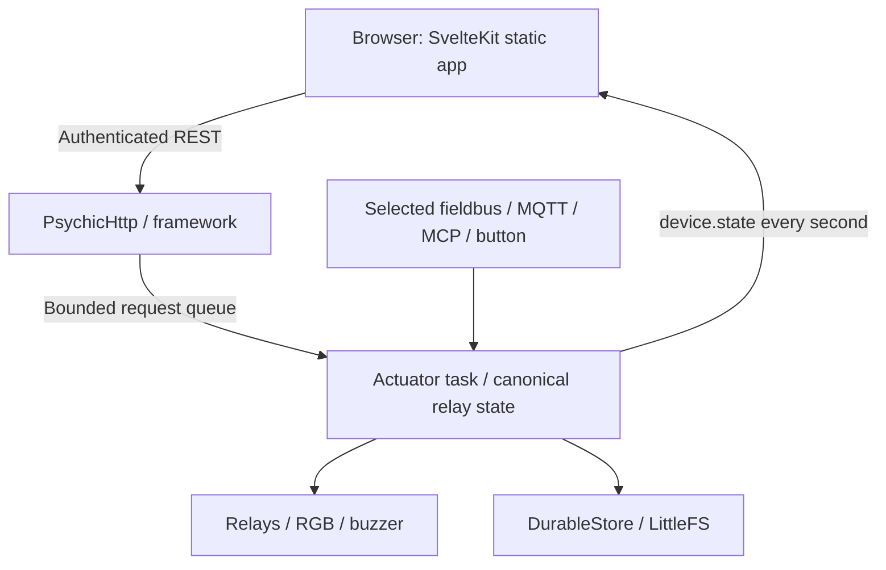

# Architecture

Source baseline: `dev` at `ced3e6d`, firmware 0.6.3. Paths below are repository-relative;
[the reviewed tree](https://github.com/betamoojw/edge_switch_actuator/tree/ced3e6d8588f5bc3650d31cdd54e1f80f8bc06e9)
is the reference when later changes differ.

## Composition and ownership

`src/main.cpp` chooses the application at compile time. With `ACTUATOR_BOARD`, it
sets safe GPIO states before framework startup, retrieves the NVS setup identity,
creates the framework with 160 endpoint slots, and starts `Actuator`. Other
profiles instantiate the light demo. The Arduino `loop()` deletes its own task.

The framework manages network and maintenance services. Its configured core is
0; the actuator creates a dedicated task on core 1 with a 16,384-byte stack and
priority 2. HTTP handlers authenticate and authorize mutations before queuing
owned requests. The queue holds eight requests; a full queue returns HTTP 503.
Reads use the actuator's recursive mutex. Queued HTTP calls wait for completion;
there is no HTTP request deadline in this path.

The actuator loop services one queued HTTP operation per iteration, MCP work,
button gestures, pulse expiry, disconnect policies, the selected fieldbus,
indicators, Home Assistant and one-second status publication. It then yields one
RTOS tick. These are scheduling choices, not measured real-time guarantees.

## Canonical state and relay arbitration

`Actuator::relay()` checks channel bounds, enablement and block state before
writing a GPIO and notifying KNX status. Web, MQTT, MCP, button and fieldbus
commands converge on actuator behavior rather than maintaining independent
output models. Transport adapters add their own permissions and input checks.
There is no cross-transport priority arbitration: a later accepted command can
replace an earlier state or pulse.

Pulse expiry and configured disconnect-off handling explicitly force outputs
low. Disabling a channel also forces it off even if blocked. GPIO state does not
measure mechanical contacts or the connected load. Runtime blocks and pulse
deadlines are not the persisted startup policy.

| Configuration | Factory value / validation |
| --- | --- |
| Six channels | Enabled, named Channel 1–6, startup OFF |
| Pulse duration | 1,000 ms; accepts 10–60,000 ms |
| Disconnect-off | Disabled; timeout 30 s, accepts 1–3,600 s |
| RGB / buzzer / button / RS485 | Enabled; RGB brightness 10% |
| Single / double / triple click | None / identify / KNX programming toggle |
| Protocol | Off |
| Modbus unit / baud / format | 1 / 19,200 / 8E1 |
| Modbus TCP | Port 502, no exact source-IP restriction |
| Bus access | Channel mask 63; indicator writes and RTU watchdog disabled |

`DeviceConfig::parse()` validates a complete schema-version-1 configuration.
`Actuator::apply()` checks its revision, stops the old protocol before starting
the new one, and rolls back on startup or storage failure. A missing network
produces `waiting_network`, which is a valid saved configuration. Successful
commits increment the general configuration revision. KNX commissioning maintains
its own revision and ownership; commissioned relay parameters are edited there.

## Protocol and network lifecycle

`NetworkSupport` uses the Arduino Network default interface only when it is
connected and has IPv4; the provisioning AP is excluded. TCP and KNX restart when
the selected uplink/interface address changes. RTU does not need an uplink.

- `src/protocols/ModbusPdu.h`: portable function decoding and validation.
- `src/protocols/Modbus.cpp`: UART/CRC and TCP/MBAP adapters, register mapping,
  channel policy, temporary configuration window and command mailbox.
- `src/protocols/KnxAdapter.cpp`: pinned KNX stack, object callbacks, web/ETS
  ownership and durable KNX image. The product uses routing, not KNX tunneling.
- `src/device/HomeAssistant.cpp`: opt-in discovery, retained state and bounded
  command intake on the existing MQTT connection.
- `lib/framework/XiaozhiMcp*`: settings, TLS transport, protocol and lifecycle;
  `src/device/XiaozhiMcpAdapter.cpp` bridges a bounded command queue to the actuator.

Home Assistant and MCP operate independently of the fieldbus selection. MQTT and
MCP connection loss alone do not create an additional relay-off policy.

## Persistence and reset

`lib/framework/DurableStore.h` stores verified, checksummed generations and reads
back writes before accepting them. Chunked strings bound JSON allocations for
the large KNX image; the old `src/device/DurableStore.h` forwards to this shared
implementation. Actuator, KNX and MCP settings use this durable mechanism.
Generic framework settings still use `FSPersistence`, which truncates and writes
one JSON file in place; they do not share the same power-loss guarantees. See
[source review](actuator-source-review.md) and [implementation history](actuator-implementation.md)
for storage risks, the KNX image migration and downgrade limits.

The framework mounts LittleFS without formatting existing data. Only a completely
erased partition is eligible for initialization. Factory reset stops connections
and protocols, drives relays low, writes `/reset.pending`, removes resettable
configuration and restarts. An interrupted reset is retried at boot. The setup
identity in the separate NVS namespace survives this process.

## Repository map

| Location | Responsibility |
| --- | --- |
| `src/main.cpp`, `src/device/`, `src/protocols/` | Product composition, control and protocols |
| `lib/framework/` | Networking, security, settings, events and maintenance |
| `lib/PsychicHttp/` | Vendored HTTP server dependency |
| `interface/src/` | Production UI, routes, types, state and translations |
| `interface/simulator/`, `interface/tests/` | Hardware-independent contract and browser checks |
| `tests/`, `scripts/test_*.py` | Portable C++ and Python regressions |
| `knx/`, `src/generated/KnxProduct.h` | KNX model, generated artifacts and firmware constants |
| `scripts/` | Frontend embedding, packaging, credential and commissioning tools |
| `platformio.ini`, `features.ini`, `factory_settings.ini` | Targets, build flags and defaults |
| `docs/`, `mkdocs.yml`, `requirements-docs.txt` | This site and its build configuration |
| `.github/workflows/` | Documentation, browser, firmware and credential CI |

For observed risks and unverified behavior, read the [source review](actuator-source-review.md).
