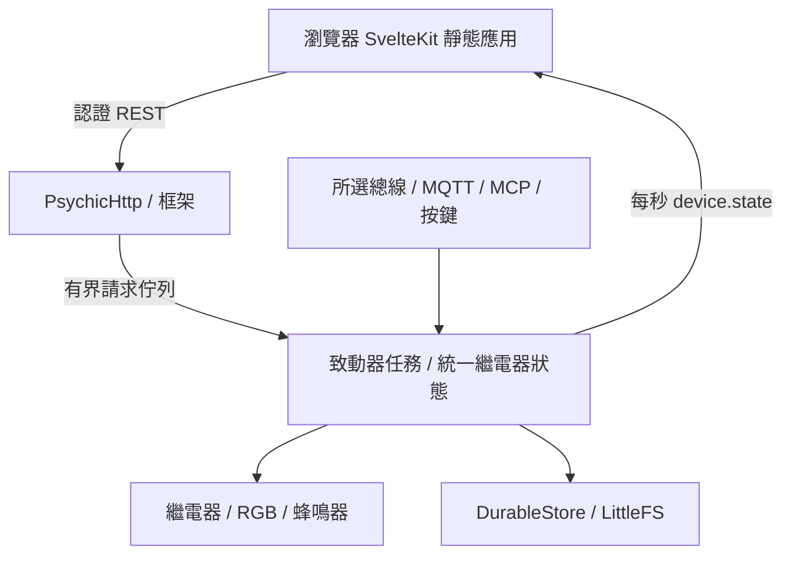

# 系統架構

原始碼基準為 `dev` 的 [`bf8cb12`](https://github.com/betamoojw/edge_switch_actuator/tree/bf8cb12ab9ada4337751968332c7d5e17e056ccc)，韌體 0.6.4。下列路徑皆相對於儲存庫根目錄。

## 組成與狀態管理 { #composition-and-ownership }

`src/main.cpp` 於編譯時選擇應用。啟用 `ACTUATOR_BOARD` 時，先設定安全 GPIO、取得 NVS 設定身份，再以 160 個端點槽建立框架及啟動 `Actuator`；其他板型建立燈光示範。Arduino `loop()` 會刪除自己的任務。

框架位於核心 0；致動器任務在核心 1，堆疊 16384 位元組、優先級 2。HTTP 變更先認證授權，再排入具有自身資料的請求，佇列容量八筆，滿時回傳 503。讀取以遞迴互斥鎖保護；已排隊 HTTP 會等候完成，此路徑未設請求期限。

每輪處理一筆 HTTP、MCP、按鍵、脈衝到期、斷線策略、現場總線、指示、HA 及每秒狀態發布，再讓出一個 RTOS tick。這是排程設計，不是量測過的即時性保證。

## 統一狀態與命令處理 { #canonical-state-and-relay-arbitration }

`Actuator::relay()` 檢查通道範圍、啟用與鎖定後寫 GPIO，並通知 KNX 狀態。網頁、MQTT、MCP、按鍵及總線共用狀態，各傳輸配接層再補權限與輸入驗證。沒有跨傳輸優先權仲裁，後接受的命令可取代既有狀態或脈衝。

脈衝到期、斷線關閉及停用可強制 LOW；停用即使遇鎖定也會關閉。GPIO 不量測機械接點或負載。執行時鎖定與脈衝期限，不是持久保存的開機策略。

| 組態 | 預設與限制 |
| --- | --- |
| 六路 | 啟用、名稱 Channel 1–6、開機 OFF |
| 脈衝 | 1000 ms，可設 10–60000 ms |
| 斷線關閉 | 停用，逾時 30 秒，可設 1–3600 |
| RGB/蜂鳴器/按鍵/RS485 | 啟用，RGB 亮度 10% |
| 單/雙/三擊 | 無動作/識別/KNX 程式設定切換 |
| 協定 | Off |
| Modbus | unit 1、19200、8E1 |
| TCP | 502，未限制精確來源 IP |
| 總線權限 | 遮罩 63，指示寫入與 RTU 看門狗停用 |

`DeviceConfig::parse()` 驗證完整 schema 1。`Actuator::apply()` 核對修訂，先停舊協定再啟動新協定；啟動或儲存失敗會回復。無網路時 `waiting_network` 仍是有效的儲存結果。成功提交增加一般修訂；KNX 有自己的修訂與擁有權，已完成設定的繼電器參數由 KNX 區域管理。

## 協定與網路生命週期 { #protocol-and-network-lifecycle }

`NetworkSupport` 僅在 Arduino Network 預設介面已連線且有 IPv4 時認定上行可用，不包括設定 AP。選定介面或位址改變會重啟 TCP/KNX；RTU 不需要網路上行。

| 檔案 | 職責 |
| --- | --- |
| `src/protocols/ModbusPdu.h` | 可攜式功能解析及驗證 |
| `src/protocols/Modbus.cpp` | UART/CRC、TCP/MBAP、映射、策略、時窗及信箱 |
| `src/protocols/KnxAdapter.cpp` | 固定 KNX 堆疊、物件回呼、web/ETS 擁有權及持久映像；使用路由，非隧道 |
| `src/device/HomeAssistant.cpp` | 現有 MQTT 上的選用探索、保留狀態及有界命令接收 |
| `lib/framework/XiaozhiMcp*` | 設定、TLS、協定及生命週期 |
| `src/device/XiaozhiMcpAdapter.cpp` | 有界 MCP 佇列銜接致動器 |

HA/MCP 與總線選擇各自獨立，其斷線不會額外觸發輸出關閉。

## 持久化與重設 { #persistence-and-reset }

`lib/framework/DurableStore.h` 寫入附檢查碼的多代資料，讀回確認後才接受。KNX 大型映像用分塊字串限制 JSON 配置；舊 `src/device/DurableStore.h` 只轉接。致動器、KNX、MCP 採此機制；一般 `FSPersistence` 仍截斷並原地寫單一 JSON，不具相同斷電特性。遷移及降版限制見[原始碼審查](actuator-source-review.md)與[實作歷程](actuator-implementation.md)。

LittleFS 掛載不會格式化現存資料，只有完全擦除的分割區可初始化。原廠重設停止連線/協定、輸出 LOW、寫 `/reset.pending`、移除可重設組態後重新啟動；若中斷，開機再嘗試。獨立 NVS 的設定身份會保留。

## 儲存庫導覽 { #repository-map }

| 路徑 | 用途 |
| --- | --- |
| `src/main.cpp`、`src/device/`、`src/protocols/` | 產品組合、控制與通訊 |
| `lib/framework/`、`lib/PsychicHttp/` | 框架服務與內附 HTTP 相依程式 |
| `interface/src/` | 正式 UI、型別、狀態與翻譯 |
| `interface/simulator/`、`interface/tests/` | 無硬體契約及瀏覽器測試 |
| `tests/`、`scripts/test_*.py` | C++/Python 回歸 |
| `knx/`、`src/generated/KnxProduct.h` | KNX 模型、產物與常數 |
| `scripts/` | UI 內嵌、封裝、認證資訊與試運轉工具 |
| `platformio.ini`、`features.ini`、`factory_settings.ini` | 目標、旗標與預設值 |
| `docs/`、`mkdocs.yml`、`requirements-docs.txt` | 文件及建置設定 |
| `.github/workflows/` | 文件、瀏覽器、韌體與認證資訊 CI |
