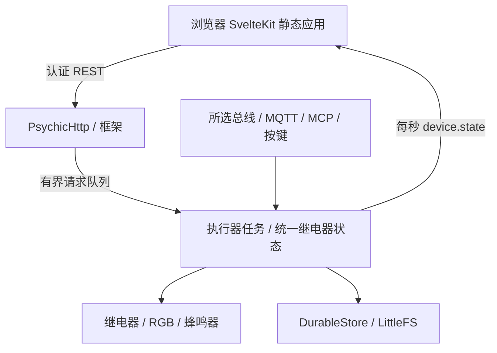

# 系统架构

源码基线为 `dev` 的 [`bf8cb12`](https://github.com/betamoojw/edge_switch_actuator/tree/bf8cb12ab9ada4337751968332c7d5e17e056ccc)，固件 0.6.4。以下路径相对于仓库根目录。

## 组成与状态所有权 { #composition-and-ownership }

`src/main.cpp` 编译时选择应用。`ACTUATOR_BOARD` 先初始化安全 GPIO、取得 NVS 设置身份，再以 160 个端点槽创建框架并启动 `Actuator`；其他板型实例化灯光演示。Arduino `loop()` 删除自身任务。

框架服务在核 0；执行器独立任务在核 1，栈 16384 字节、优先级 2。HTTP 修改先认证授权，再将自有请求排队；队列最多八项，满时返回 503。读取使用递归互斥锁，已排队的 HTTP 等待完成，此路径没有请求截止时间。

每次循环处理一个 HTTP 操作、MCP、按键、脉冲到期、断连策略、所选总线、指示器、HA 和一秒状态发布，然后让出一个 RTOS tick。这是调度配置，不是实测实时保证。

## 统一状态与命令处理 { #canonical-state-and-relay-arbitration }

`Actuator::relay()` 检查范围、启用、锁定后写 GPIO 并通知 KNX。网页、MQTT、MCP、按键和总线共享这一状态，传输层再加自己的权限检查。没有跨协议优先级仲裁，后接受的命令可取代先前状态或脉冲。

脉冲到期、断连关闭及禁用均可强制 LOW；禁用即使在锁定时也强制关闭。GPIO 不反映机械触点或负载。运行时锁定及脉冲期限不是持久化启动策略。

| 配置 | 默认值与范围 |
| --- | --- |
| 六路 | 启用、Channel 1–6、启动 OFF |
| 脉冲 | 1000 ms，10–60000 ms |
| 断连关闭 | 禁用，超时 30 秒，允许 1–3600 |
| RGB/蜂鸣器/按键/RS485 | 启用，RGB 亮度 10% |
| 单/双/三击 | 无动作/识别/KNX 编程切换 |
| 协议 | Off |
| Modbus | unit 1、19200、8E1 |
| TCP | 502，无精确源 IP 限制 |
| 总线权限 | 掩码 63，指示写及 RTU 看门狗关闭 |

`DeviceConfig::parse()` 校验完整 schema 1。`Actuator::apply()` 检查修订，停旧协议再启新协议，启动或存储失败回滚。无网络时 `waiting_network` 是合法保存状态。成功提交递增一般修订；KNX 有独立修订和所有权，已调试的继电器参数在那里编辑。

## 协议与网络生命周期 { #protocol-and-network-lifecycle }

`NetworkSupport` 只在 Arduino Network 默认接口已连接且有 IPv4 时认为上行可用，排除配网 AP。上行/地址改变会重启 TCP/KNX；RTU 不需上行。

| 文件 | 职责 |
| --- | --- |
| `src/protocols/ModbusPdu.h` | 可移植功能解析与验证 |
| `src/protocols/Modbus.cpp` | UART/CRC、TCP/MBAP、映射、策略、窗口及邮箱 |
| `src/protocols/KnxAdapter.cpp` | 固定 KNX 栈、对象回调、web/ETS 所有权、持久镜像；使用路由，不是隧道 |
| `src/device/HomeAssistant.cpp` | 现有 MQTT 上的可选发现、保留状态、有界命令接收 |
| `lib/framework/XiaozhiMcp*` | 设置、TLS、协议和生命周期 |
| `src/device/XiaozhiMcpAdapter.cpp` | 有界 MCP 队列连接执行器 |

HA/MCP 独立于总线模式，其断开本身不新增关闭策略。

## 持久化与复位 { #persistence-and-reset }

`lib/framework/DurableStore.h` 写入带校验和的多代数据，并读回验证；KNX 大镜像采用分块字符串限制 JSON 分配，旧路径 `src/device/DurableStore.h` 仅转发。执行器、KNX、MCP 使用此机制；通用 `FSPersistence` 仍截断并原地写单个 JSON，不具备相同掉电性质。迁移及降级限制见[源码审查](actuator-source-review.md)、[历史实现](actuator-implementation.md)。

LittleFS 挂载不会格式化已有数据，仅全擦除分区可初始化。复位会停止连接/协议、输出 LOW、写 `/reset.pending`、删除可重置配置再重启；中断复位下次启动重试。独立 NVS 中的设置身份保留。

## 仓库目录 { #repository-map }

| 路径 | 用途 |
| --- | --- |
| `src/main.cpp`、`src/device/`、`src/protocols/` | 产品组合、控制及协议 |
| `lib/framework/`、`lib/PsychicHttp/` | 框架服务及内置 HTTP 依赖 |
| `interface/src/` | 生产 UI、类型、状态和翻译 |
| `interface/simulator/`、`interface/tests/` | 无硬件契约和浏览器测试 |
| `tests/`、`scripts/test_*.py` | C++/Python 回归 |
| `knx/`、`src/generated/KnxProduct.h` | KNX 模型、产物及常量 |
| `scripts/` | UI 嵌入、打包、凭据与调试工具 |
| `platformio.ini`、`features.ini`、`factory_settings.ini` | 目标、标志、默认值 |
| `docs/`、`mkdocs.yml`、`requirements-docs.txt` | 文档及构建 |
| `.github/workflows/` | 文档、浏览器、固件、凭据 CI |
