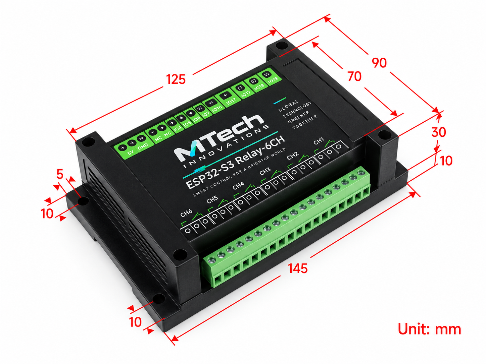
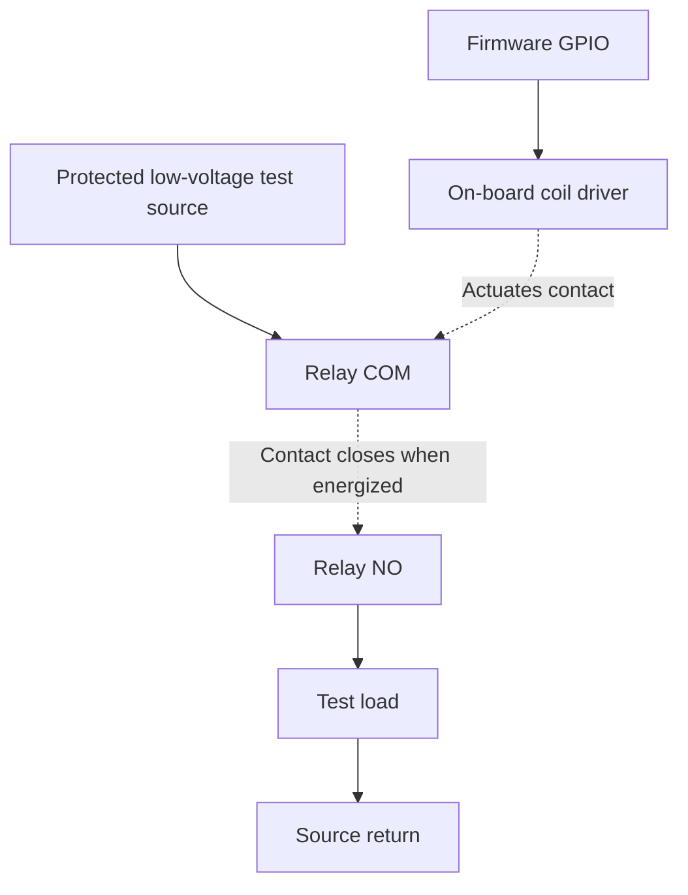

# ESP32-S3-Relay-6CH hardware reference

Vendor documentation rechecked 2026-10-10. Board: Waveshare ESP32-S3-Relay-6CH,
SKU 26756. Pin assignments below agree with `src/device/BoardProfile.h` in the
reviewed source. Agreement between source and vendor documentation is not a
physical continuity test or electrical qualification of the installed board.

## Hardware overview

*Project-supplied hardware image. Open the image for a full-resolution view.*
Use it to identify the enclosure and connection areas. For wiring, use the
verified assignments below and the labels on the fitted PCB; the two supplied
images show different top-terminal legends.

## Verified vendor information

| Resource | Assignment |
| --- | --- |
| MCU | ESP32-S3; dual-core LX7, up to 240 MHz |
| Wireless | 2.4 GHz Wi-Fi, Bluetooth LE; external antenna |
| Supply | 7–36 V DC terminal or 5 V / 1 A USB-C |
| Relays | Six changeover channels, COM/NO/NC; vendor maximum per channel 10 A at 250 V AC or 30 V DC |
| CH1 / CH2 / CH3 | GPIO1 / GPIO2 / GPIO41 |
| CH4 / CH5 / CH6 | GPIO42 / GPIO45 / GPIO46 |
| RGB | One WS2812, data GPIO38 |
| Buzzer | Passive, PWM GPIO21 |
| BOOT | GPIO0 |
| RS485 | Isolated; UART TX GPIO17, RX GPIO18; selectable 120-ohm termination |
| Other | RESET, USB-C, Pico-compatible expansion headers, power/TX/RX indicators |

Source: [Waveshare hardware documentation](https://docs.waveshare.com/ESP32-S3-Relay-6CH).

The [vendor Arduino guide](https://docs.waveshare.com/ESP32-S3-Relay-6CH/Arduino) describes HIGH as relay ON, LOW as OFF. Its example serial commands include a nonstandard toggle value; do not copy that command table as this product's Modbus specification.

The [schematic](https://files.waveshare.com/wiki/ESP32-S3-Relay-6CH/ESP32-S3-Relay-6CH.pdf) identifies an ESP32-S3-WROOM-1U module and TX-derived enable circuitry. Design inference: use automatic RS485 direction, without allocating a fictional DE GPIO; verify turnaround on the actual board. BOOT is pulled up and switches to ground.

## Implementation constraints and verification

These are product engineering decisions, not additional vendor specifications:

- Use a dedicated, immutable board pin profile. Do not expose pin remapping in the dashboard. Expansion functions must not share actuator pins.
- Send WS2812 frames; ordinary `digitalWrite()` cannot select its color. Reserve the PWM peripheral used by the passive buzzer independently of the RGB driver.
- Initialize all relay outputs LOW before networking or filesystem work. Validate with an oscilloscope through power-on, reset, flashing, brownout, watchdog and OTA restart. Software initialization alone cannot guarantee the electrical state before firmware runs.
- GPIO0 participates in boot selection. Runtime factory reset requires a press after application startup; BOOT held during power-on can enter the downloader. GPIO45/46 also require boot-strapping review against the actual module and board revision.
- Report relay state as **commanded output**, not verified contact position. No contact-feedback path has been established from the reviewed materials.
- Treat all six channels independently. No motor reversing, blind control or safety interlock rating is implied.
- Verify fitted flash capacity, PSRAM and module suffix before selecting partitions. The repository's 8 MB partition layout is not evidence of the board's memory configuration.
- Bench-verify buzzer usable frequency/duty limits, RGB color order and brightness, UART baud/parity combinations, automatic direction timing and termination position.
- Use a low-voltage test fixture for firmware bring-up. Product qualification must establish load derating, thermal limits, inrush handling and installation protection for its actual loads; the contact maximum is not a six-channel simultaneous-load qualification.
- Wi-Fi is the baseline IP interface. Onboard Ethernet and KNX TP hardware are not part of this board profile. RS485 is not a KNX TP interface.

## Enclosure dimensions

*Project-supplied dimension image; units are millimetres as marked. Open the image
to inspect its dimension arrows.* The annotations describe the illustrated
enclosure and have not been independently measured during the documentation
inspection. Confirm the actual enclosure, mounting-hole positions and clearance
for wiring and antenna before drilling or planning an installation. These
enclosure dimensions are separate from the Waveshare board specification.

## Installation and wiring workflow

This is functional guidance, not a site-specific electrical design. Have a
qualified installer select conductors, protection, enclosure, separation and
load ratings for the actual application. Isolate all supplies before wiring.
Use the terminal legends on the fitted PCB and its matching vendor schematic;
do not infer terminal order from GPIO numbers or promotional renders.

1. Record PCB/module revision and intended supply. Choose a supported power
   input; do not assume that parallel USB and terminal supplies are permitted.
2. For a low-voltage test fixture, use COM and NO for an initially open contact
   path. NC is the alternative contact; do not assume OFF means the load is
   de-energized when it is wired through NC.
3. Keep the relay contact circuit distinct from logic power. The firmware drives
   the coil; it does not supply the load through a GPIO or measure the contacts.
4. Wire RS485 as a bus using the actual A/B reference for both devices. Confirm
   termination only at the intended bus ends and use the board's selectable
   termination appropriately. Verify polarity and reference/ground arrangements
   against the vendor schematic and master instructions.
5. Inspect clearances, strain relief, protection and supply polarity before
   energizing. Start with read-only UI checks, then the approved
   [commissioning procedure](commissioning.md).

The diagram is a conceptual low-voltage fixture, not a mains wiring drawing or
terminal-position diagram. NO/NC refer to the relay's de-energized position.
Verify that the chosen load and protection remain suitable for inrush and fault
conditions. The maximum contact rating does not qualify simultaneous full-load
operation of all channels.

The [live system page](interface-tour.md#7-system-status-and-navigation) reported
approximately 16 MiB flash on one unit. Keep the source's 8 MB partition selection
and fitted flash identification distinct. Neither observation verifies every
procurement revision. The supplied enclosure images provide visual context;
confirm their dimensions and terminal positions against the fitted hardware.

## Manufacturing record to retain

For each qualified hardware revision record PCB marking, module suffix, flash/PSRAM detection, pin/polarity verification, boot traces, relay continuity results, RS485 waveform captures, supply/current measurements, firmware hash and fixture version. Preserve device identity separately from resettable user settings.

Additional resource index: [Waveshare resources](https://docs.waveshare.com/ESP32-S3-Relay-6CH/Resources-And-Documents). Recheck the schematic and fitted parts whenever the procurement revision changes.
