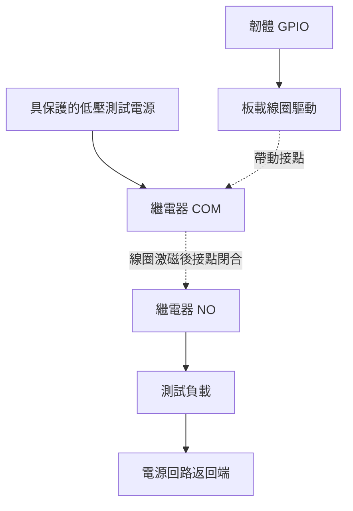

# ESP32-S3-Relay-6CH 硬體參考

使用板卡為 Waveshare ESP32-S3-Relay-6CH，SKU 26756。廠商資料於 2026-10-10 核對，下列腳位符合 `src/device/BoardProfile.h`。文件與程式一致，不等於已完成實體導通或電氣資格驗證。

## 硬體概覽 { #hardware-overview }

*圖片由專案提供，可開啟原圖。* 供辨識外觀與連接區域；兩張圖的上方端子文字不同，配線應以實際 PCB 標示及相符電路圖為準。

## 已核對的廠商資料 { #verified-vendor-information }

| 項目 | 規格或配置 |
| --- | --- |
| MCU | ESP32-S3，雙核心 LX7，最高 240 MHz |
| 無線 | 2.4 GHz Wi-Fi、Bluetooth LE、外接天線 |
| 電源 | 端子 7–36 V DC，或 USB-C 5 V / 1 A |
| 繼電器 | 六路切換接點 COM/NO/NC；廠商單路上限 10 A、250 V AC 或 30 V DC |
| CH1 / CH2 / CH3 | GPIO1 / GPIO2 / GPIO41 |
| CH4 / CH5 / CH6 | GPIO42 / GPIO45 / GPIO46 |
| RGB | 一顆 WS2812，資料 GPIO38 |
| 蜂鳴器 | 被動式，PWM GPIO21 |
| BOOT | GPIO0 |
| RS485 | 隔離介面，UART TX GPIO17、RX GPIO18，可選 120 Ω 終端電阻 |
| 其他 | RESET、USB-C、Pico 相容擴充排針、電源/TX/RX 指示燈 |

來源：[Waveshare 硬體文件](https://docs.waveshare.com/ESP32-S3-Relay-6CH)。[Arduino 指南](https://docs.waveshare.com/ESP32-S3-Relay-6CH/Arduino)指出 HIGH 為 ON、LOW 為 OFF；廠商序列範例含非標準切換值，不可用作本專案的 Modbus 規格。

[電路圖](https://files.waveshare.com/wiki/ESP32-S3-Relay-6CH/ESP32-S3-Relay-6CH.pdf)列出 ESP32-S3-WROOM-1U 及由 TX 衍生的致能電路。據此推論，RS485 採自動方向控制，不應自行分配不存在的 DE 腳位；實際收發轉向仍需量測。BOOT 為上拉，按下接地。

## 實作限制與驗證 { #implementation-constraints-and-verification }

以下是專案工程規則，並非廠商新增規格：

- 板型腳位固定，網頁不提供重新對應；擴充功能不得共用致動器腳位。
- WS2812 需要資料訊框，`digitalWrite()` 無法選色；蜂鳴器 PWM 須與 RGB 驅動分配獨立資源。
- 網路或檔案系統啟動前先將繼電器輸出設 LOW。上電、重設、燒錄、低電壓、看門狗及 OTA 重啟的電氣波形須以示波器確認，軟體初始化不足以保證韌體執行前的狀態。
- GPIO0 參與開機選擇；上電時按住 BOOT 可能進入下載模式，應用重設手勢須於啟動後按下。GPIO45/46 也須依模組與 PCB 版本檢查啟動綁定條件。
- 狀態是**命令輸出**，尚無確認過的接點回授路徑。六路各自獨立，不代表具備馬達反轉、窗簾控制或安全互鎖額定能力。
- 選分割區前核對 Flash、PSRAM 與模組後綴；程式採用 8 MB 分割表不能證明實際記憶體容量。
- 工作臺測試須核對蜂鳴器頻率/工作週期、RGB 色序/亮度、UART 參數、收發轉向及終端電阻位置。
- 初次啟用請使用低壓治具。實際產品仍須評估負載降額、溫升、突入電流與保護；接點上限不代表六路同時滿載合格。
- 預設 IP 介面為 Wi-Fi；此組態沒有板載乙太網路或 KNX TP，RS485 也不是 KNX TP 介面。

## 外殼尺寸 { #enclosure-dimensions }

*專案提供的尺寸示意，單位依圖為毫米。* 文件檢查未另行量測；鑽孔或規劃安裝前，請確認實際外殼、孔位，以及配線和天線所需淨空。外殼尺寸與 Waveshare PCB 規格不同。

## 安裝與配線程序 { #installation-and-wiring-workflow }

本節是功能說明，不是現場電氣設計。線材、保護、箱體、隔離距離及負載額定值應由合格安裝人員決定。施工前隔離全部電源，依實際端子與相符電路圖配線，不可從 GPIO 編號或宣傳圖推測端子順序。

1. 記錄 PCB/模組版本與電源方案，使用支援的輸入方式，勿假設 USB 與端子電源可並接。
2. 低壓治具若需初始開路，可使用 COM/NO。NC 為另一接點；使用 NC 時，OFF 不一定讓負載斷電。
3. 接點迴路與邏輯電源分開，GPIO 僅控制線圈，不直接供應負載或量測接點。
4. RS485 依總線拓撲配線，確認雙方 A/B 定義；僅於預定兩端作終端匹配，參考地依電路圖及主站說明處理。
5. 送電前檢查間距、拉力防護、電路保護與極性，先做唯讀確認，再執行核准的[驗收](commissioning.md)。

這是低壓治具概念圖，不是市電配線或端子位置圖。NO/NC 依線圈未激磁狀態命名；負載與保護須考慮突入電流及故障。一部實機的[系統頁](interface-tour.md#7-system-status-and-navigation)曾回報約 16 MiB Flash，與原始碼選用 8 MB 分割表應分開看待，也不能推定所有採購批次相同。

## 製造紀錄 { #manufacturing-record-to-retain }

每一合格硬體版本應保留 PCB 標記、模組後綴、Flash/PSRAM 偵測、腳位/極性、開機波形、接點導通、RS485 波形、電壓/電流、韌體雜湊與治具版本。裝置身份應與可重設組態分開儲存。採購版本改變時，重新核對[資源及電路圖](https://docs.waveshare.com/ESP32-S3-Relay-6CH/Resources-And-Documents)。
