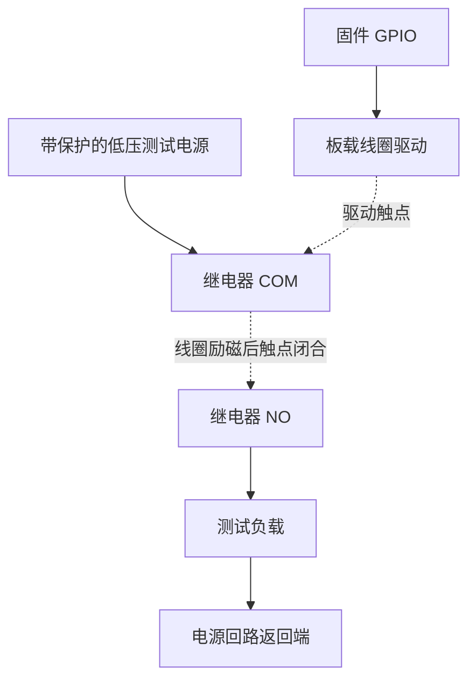

# ESP32-S3-Relay-6CH 硬件参考

板卡为 Waveshare ESP32-S3-Relay-6CH，SKU 26756。厂商资料于 2026-10-10 核对；以下引脚与 `src/device/BoardProfile.h` 一致。资料一致不等于实物导通检查或电气资格验证。

## 硬件概览 { #hardware-overview }

*项目提供的图片，可打开查看原尺寸。* 用于识别外壳与接口区域；两张图片顶部端子标注不同，接线须以实际 PCB 标记和匹配原理图为准。

## 已核对的厂商资料 { #verified-vendor-information }

| 项目 | 参数或分配 |
| --- | --- |
| MCU | ESP32-S3，双核 LX7，最高 240 MHz |
| 无线 | 2.4 GHz Wi-Fi、Bluetooth LE、外置天线 |
| 供电 | 端子 7–36 V DC，或 USB-C 5 V / 1 A |
| 继电器 | 六路转换触点 COM/NO/NC；厂商单路最大值 10 A、250 V AC 或 30 V DC |
| CH1 / CH2 / CH3 | GPIO1 / GPIO2 / GPIO41 |
| CH4 / CH5 / CH6 | GPIO42 / GPIO45 / GPIO46 |
| RGB | 一颗 WS2812，数据 GPIO38 |
| 蜂鸣器 | 无源，PWM GPIO21 |
| BOOT | GPIO0 |
| RS485 | 隔离接口，UART TX GPIO17、RX GPIO18，可选 120 Ω 终端电阻 |
| 其他 | RESET、USB-C、Pico 兼容扩展排针、电源/TX/RX 指示灯 |

依据：[Waveshare 硬件文档](https://docs.waveshare.com/ESP32-S3-Relay-6CH)。[Arduino 指南](https://docs.waveshare.com/ESP32-S3-Relay-6CH/Arduino)说明 HIGH 为 ON、LOW 为 OFF；其串口示例含非标准切换值，不能当作本项目的 Modbus 规范。

[原理图](https://files.waveshare.com/wiki/ESP32-S3-Relay-6CH/ESP32-S3-Relay-6CH.pdf)标注 ESP32-S3-WROOM-1U 和由 TX 派生的使能电路。据此推断应使用自动 RS485 方向控制，不应虚构 DE 引脚；实际转向时序仍需测量。BOOT 上拉，按下接地。

## 实现约束与验证 { #implementation-constraints-and-verification }

以下属于项目工程约束，而不是额外的厂商规格：

- 板型引脚固定，不开放网页重映射，扩展功能不得占用执行器引脚。
- WS2812 需要数据帧，普通 `digitalWrite()` 不能选择颜色；蜂鸣器 PWM 资源应与 RGB 驱动独立。
- 联网和文件系统初始化前先将继电器 GPIO 置 LOW；上电、复位、刷写、欠压、看门狗和 OTA 重启的实际波形须用示波器验证，不能仅靠软件初始化保证。
- GPIO0 影响启动模式，开机按住 BOOT 可能进入下载器；应用复位手势须启动后按下。GPIO45/46 也需按模块与 PCB 版本检查启动绑带约束。
- 状态是**命令输出**，没有已确认的触点反馈通路。六路独立，不提供电机反转、窗帘或安全互锁额定能力。
- 分区选择前确认闪存、PSRAM 和模块后缀；源码的 8 MB 分区不能证明实物容量。
- 台架验证蜂鸣器频率/占空比、RGB 色序/亮度、UART 参数、自动方向时序及终端电阻位置。
- 用低压夹具做初次调试；实际应用须验证负载降额、温升、浪涌和保护。触点最大额定值不等于六路同时满载已合格。
- 默认 IP 接口为 Wi-Fi；此板型没有板载以太网或 KNX TP。RS485 不是 KNX TP。

## 外壳尺寸 { #enclosure-dimensions }

*项目提供的尺寸图，单位按图示为毫米。* 本次未独立测量；钻孔或布置安装前，应核对实物外壳、孔位和接线/天线空间。外壳尺寸不等同于 Waveshare PCB 规格。

## 安装与接线流程 { #installation-and-wiring-workflow }

这是功能说明，不是现场电气设计。由合格安装人员选择线材、保护、外壳、隔离间距与负载额定值。接线前隔离全部电源，按实物端子标记和对应原理图施工，不要从 GPIO 编号或渲染图推断端子顺序。

1. 记录 PCB/模块版本和供电方式。选用支持的输入，不要假定 USB 与端子可并联供电。
2. 低压夹具初始断开回路可使用 COM/NO。NC 是另一触点，接在 NC 上的负载不一定在 OFF 时断电。
3. 触点回路与逻辑电源分开；GPIO 驱动线圈，不负责给负载供电或测量触点。
4. RS485 按总线拓扑接线，核对双方 A/B 定义；仅在计划的总线两端终端匹配，按原理图及主站要求处理参考地。
5. 通电前检查间距、应力释放、保护及极性，先只读检查，再执行获批准的[验收](commissioning.md)。

这是低压夹具原理示意，不是市电接线图或端子位置图。NO/NC 以线圈未励磁为基准；负载及保护须适应浪涌和故障。一台设备的[系统页](interface-tour.md#7-system-status-and-navigation)曾报告约 16 MiB 闪存，与源码选用 8 MB 分区是两回事，也不能推及所有采购批次。

## 制造记录 { #manufacturing-record-to-retain }

各合格硬件版本应记录 PCB 标记、模块后缀、闪存/PSRAM 检测、引脚/极性、启动波形、触点导通、RS485 波形、电源/电流、固件哈希和夹具版本。设备身份与可复位设置分开保存。采购版本变化时重新核对[资源与原理图](https://docs.waveshare.com/ESP32-S3-Relay-6CH/Resources-And-Documents)。
