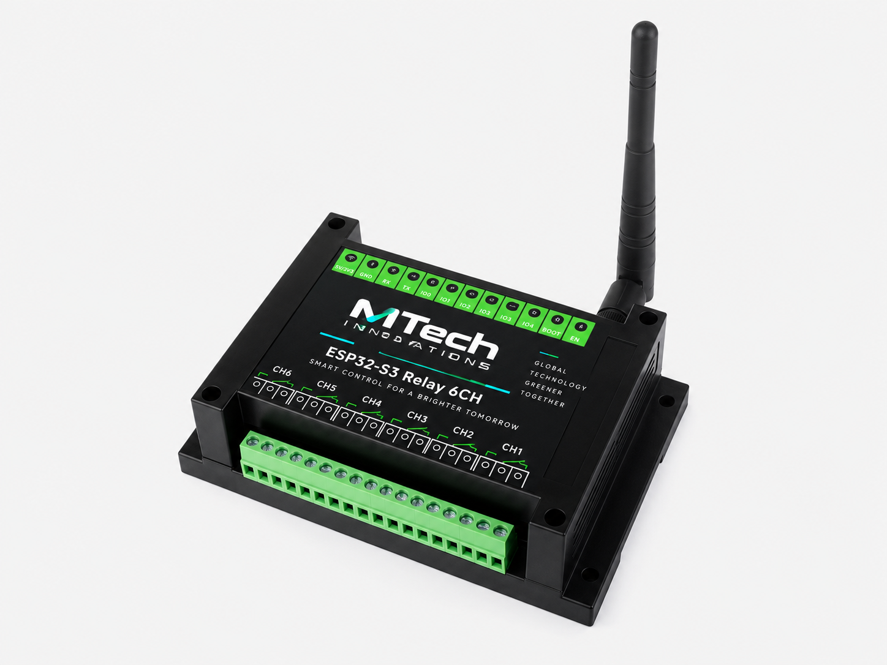
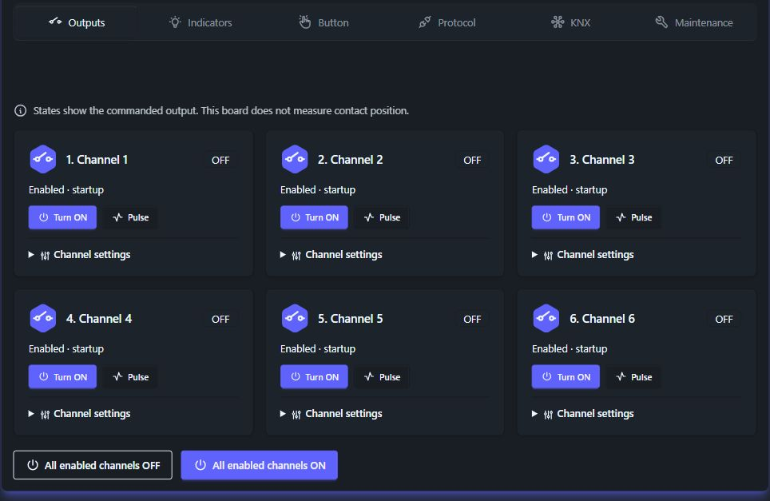

# Edge Switching Actuator

通过浏览器或自动化网络控制六路继电器。项目由 ESP32-S3 固件、Svelte 5 / SvelteKit 界面以及调试、测试和固件打包工具组成。

本文对应 **`dev` 分支、固件 0.6.4**，源码审查基线为 [`bf8cb12`](https://github.com/betamoojw/edge_switch_actuator/tree/bf8cb12ab9ada4337751968332c7d5e17e056ccc)，审查日期为 **2026 年 10 月 11 日**。这是开发分支文档，不代表所有功能已完成生产环境验证。请先阅读[版本变更](release-notes.md)。

## 从这里开始 { #start-here }

*项目提供的硬件图片。[硬件参考](esp32-s3-relay-6ch-hardware.md)说明引脚、接线和[外壳尺寸](esp32-s3-relay-6ch-hardware.md#enclosure-dimensions)。*

[首次连接设备](quick-start.md){ .md-button .md-button--primary }
[查看真实界面](interface-tour.md){ .md-button }

*英语界面，固件 0.6.3，拍摄于 2026 年 10 月 10 日。保存的设置可能与出厂默认值不同；界面状态不能证明触点实际动作。参见[检查记录](live-verification.md)。*

| 你的目标 | 建议阅读 |
| --- | --- |
| 连接已刷好固件的设备 | [首次使用](quick-start.md) |
| 编译固件或体验模拟器 | [开发入门](gettingstarted.md) |
| 规划安装、接线与交付 | [硬件](esp32-s3-relay-6ch-hardware.md)、[验收](commissioning.md) |
| 操作继电器、指示灯和按键 | [设备操作](device-operation.md) |
| 查找设备密码或制作设置标签 | [设备凭据](device-credentials.md) |
| 接入 Modbus 或 KNX | [寄存器映射](actuator-modbus-map.md)、[KNX 调试](knx-address-entry.md) |
| 接入自动化服务 | [Home Assistant](home-assistant.md)、[小智 MCP](xiaozhi-mcp.md) |
| 理解或扩展代码 | [架构](architecture.md)、[API](restfulapi.md)、[前端](structure.md) |
| 评估部署条件与排查问题 | [源码审查](actuator-source-review.md)、[故障排查](troubleshooting.md) |

## 适用场景 { #practical-uses }

- **本地控制面板：** 为操作人员提供带名称的通道控制、定时脉冲和命令状态，并按角色及通道分配权限。
- **楼宇自动化评估：** 通过 Modbus 或 KNX/IP 路由接入独立负载，使用前须确认负载适配并完成调试。本项目不提供电机互锁或安全控制器功能。
- **家庭自动化：** 使用 MQTT 和 Home Assistant 发现继电器及诊断实体，访问控制由代理服务器负责。
- **语音或智能体控制：** 通过私有 WSS 端点将选定通道接入小智 MCP。
- **开发与台架测试：** 在授权物理测试之前，先使用界面模拟器和主机端协议测试。

[集成方式](integrations.md)列出了前提条件。这些用途描述不构成硬件认证或适用性保证。

## 当前功能 { #what-the-product-implements }

默认的 `waveshare-relay-6ch` 配置控制六路继电器、BOOT 按键、RGB 指示灯、蜂鸣器和 RS485。每路可设置启用状态、名称、启动状态、脉冲时长及断连策略。浏览器从 `/device` 进入，操作由认证和权限约束。

现场总线只能选择一种：**Off、Modbus RTU、Modbus TCP 或 KNX/IP**。MQTT/Home Assistant 和小智 MCP 可与所选总线同时运行；两者默认关闭，MCP 默认不开放任何继电器。

管理功能包括 Wi-Fi STA/AP、NTP、用户、遥测、崩溃诊断及 OTA。[界面偏好](ui-preferences.md)支持七种语言和五种主题。以太网仅用于其他框架板型，默认 Waveshare 配置未启用。

## 使用边界 { #boundaries }

- 输出状态表示固件下达的命令，没有继电器触点反馈。
- 配网 AP 不算 TCP、KNX 或外连服务所需的上行网络。
- 管理服务器使用 HTTP，应部署在受控网络内。
- KNX 产品包、历史硬件测试及模拟器测试均有适用范围，见[验证记录](validation.md)。
- 其他 PlatformIO 板型仍包含模板或演示应用，不能直接替代六路执行器配置。

## 项目与许可证 { #project-and-license }

[源码仓库](https://github.com/betamoojw/edge_switch_actuator/tree/dev)。项目基于 [ESP32-SvelteKit](https://github.com/theelims/ESP32-sveltekit) 及其 ESP8266 React 前身。后端采用 LGPL-3.0，前端采用 MIT；以仓库 [LICENSE](https://github.com/betamoojw/edge_switch_actuator/blob/dev/LICENSE) 为准。

## 截图版本说明 { #screenshot-currency }

`media/live/` 中的截图来自英语界面、固件 **0.6.3**。0.6.4 将侧栏的 Discord 链接换成 **Project website**。KNX 用户提供图片的固件版本未经确认。图片仅作为相应时间的界面证据，不代表 0.6.4 的硬件验证结果。
