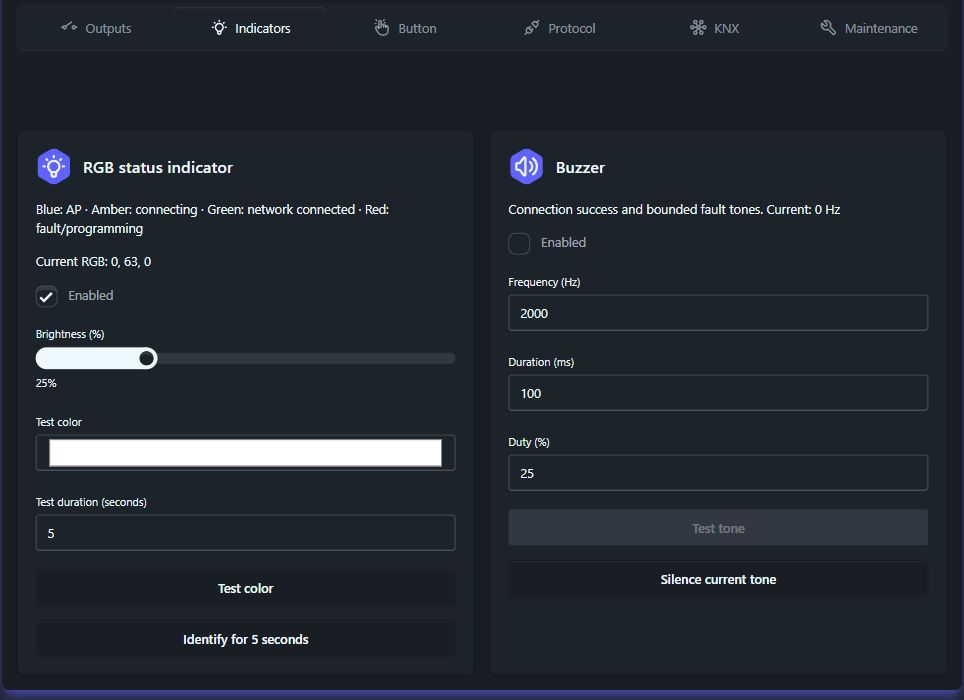
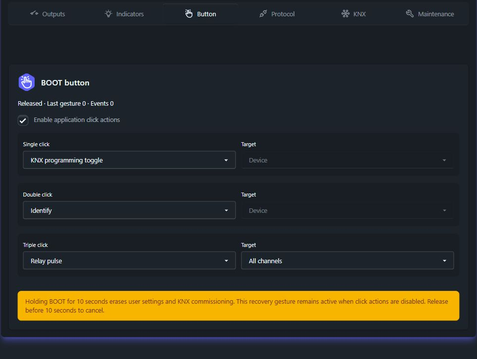
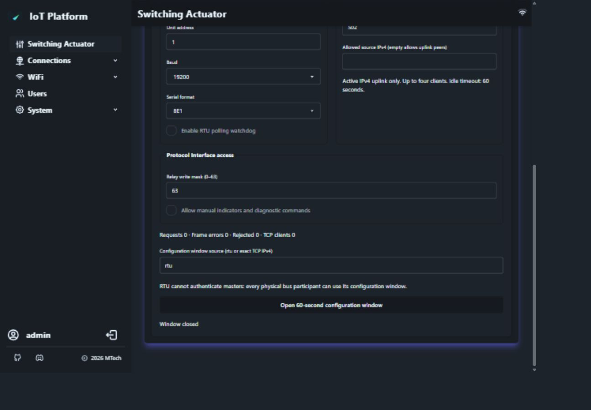
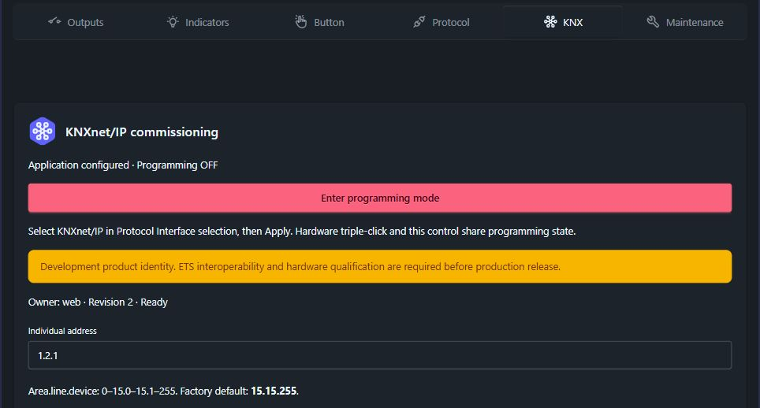
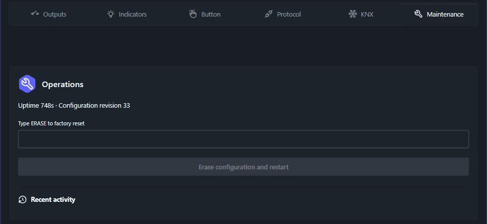
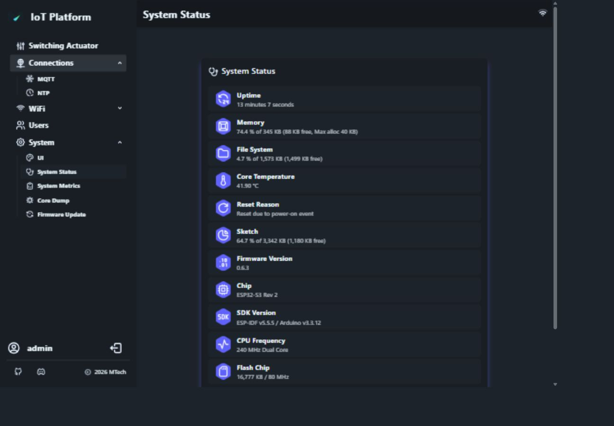

# 界面导览

以下为真实 Waveshare 设备的**英语界面**，于 **2026 年 10 月 10 日**只读采集，显示固件 **0.6.3**，具体提交未知。画面是已保存的设置，不是出厂默认值。未操作继电器、指示器、配置、复位或升级。说明编号位于图片下方，没有修改设备画面；裁剪已省略网络身份及凭据。可打开原图查看细节。[检查记录](live-verification.md)区分实测观察和源码行为。

## 1. 输出 { #1-outputs }

1. **通道和 OFF：** 编号 1–6，检查时全部显示 OFF；没有触点反馈。
2. **Enabled · startup：** 已启用，最后命令来源是启动流程；启动策略须另查设置。
3. **Turn ON / Pulse：** 有权限的操作员可发出命令；脉冲到期强制 OFF。本次未按下这些按钮。
4. **设置与批量操作：** 安装人员/管理员设置权限不同于运行命令权限；任一启用通道被锁定或无权限时，网页批量操作整体拒绝。见[角色](device-operation.md#access-roles)。

## 2. 指示器 { #2-indicators }

1. **RGB：** 本机显示绿色 `(0, 63, 0)`、亮度 25%；源码默认亮度为 10%。
2. **Test color / Identify：** 会产生实际动作；故障、复位或编程等更高优先级可覆盖测试。
3. **蜂鸣器：** Enabled 未选中，频率 0 Hz，测试按钮禁用；没有验证声音或 LED 实际发光。

## 3. 按键 { #3-button }

1. **Released / 事件计数：** 软件报告按键释放，采集时没有识别到事件。
2. **绑定：** 本机为单击编程、双击识别、三击全部脉冲；源码默认是无动作、识别、编程切换。按 BOOT 前先确认当前绑定。
3. **长按：** 十秒会清除设置与调试数据，即使应用点击动作被禁用也一样。没有恢复计划时不要在已安装设备上测试。

## 4. 协议访问 { #4-protocol-access }

1. **掩码 63：** 位 0–5 允许 Modbus 写六路，与网页账号和 MCP 权限独立。
2. **手动指示和诊断：** 本机未勾选。
3. **计数及窗口：** 零计数不能证明链路健康，尤其当前选中 KNX。打开窗口会临时授予配置访问；此次保持关闭。RTU 无法逐一认证 RS485 主站。

未包含在裁剪图中的选择器显示 **KNXnet/IP**。非活动 RTU/TCP 的设置仍可能可见；同时只运行一种现场总线。

## 5. KNX 调试 { #5-knx-commissioning }

1. **已配置 / Programming OFF：** 只是软件状态，不证明 ETS 验收或报文实测完成。
2. **所有权与修订：** 显示 web 和修订 2。KNX 使用独立修订号，冲突后应重新读取。
3. **地址：** `1.2.1` 是该机保存值；应按现场拓扑分配唯一地址，出厂提示为 `15.15.255`。

画面的三击提示假定默认绑定，与本机单击绑定不符，应以[按键设置](#3-button)及 [KNX 指南](knx-address-entry.md)为准。开发身份警告不代表 KNX 认证。[ETS 与网页所有权示例](knx-address-entry.md#ets-download-and-web-ownership-screenshot-walkthrough)来自另外提供的图片。

## 6. 维护 { #6-maintenance }

1. **修订和运行时间：** 可用于定位问题，但运行时间不是耐久性测试。
2. **清除确认：** 属于破坏性恢复，不是保存或退出。本次未填写或执行。
3. **近期活动：** 仅保存在内存，不是持久审计档案。

## 7. 系统状态与导航 { #7-system-status-and-navigation }

1. **固件、芯片和 SDK：** 报障时一并记录，尽可能提供镜像哈希；版本字符串不能唯一标识编译选项。
2. **内存、文件系统及温度：** 是瞬时遥测，不是热或堆内存验证。
3. **系统菜单：** 偏好设置、状态、指标、核心转储和升级各有页面。升级需使用匹配的 `_ota.bin`，见[镜像选择](buildprocess.md#firmware-build-and-release-artifacts)。

观察时 Connections 有 MQTT、NTP，没有小智 MCP；MQTT 显示 Disabled。因此 HA/MCP 指南依据当前源码，不是该设备的端到端测试结果。

## 截图版本说明 { #screenshot-currency }

0.6.4 已将旧 Discord 侧栏入口改为 **Project website**，上述 0.6.3 截图尚未体现。用户提供的 KNX 图片版本未知。不要将这些截图视为 0.6.4 硬件验证。
