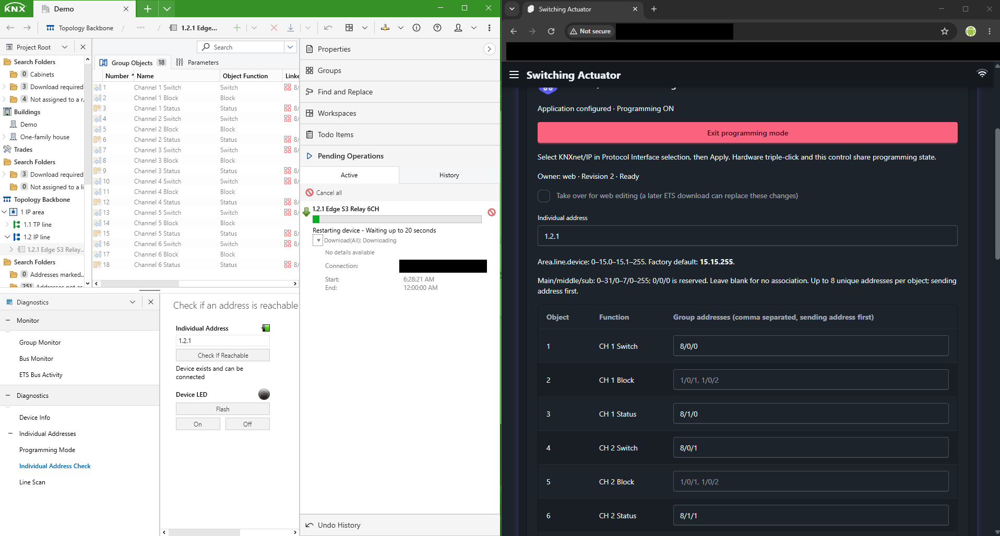
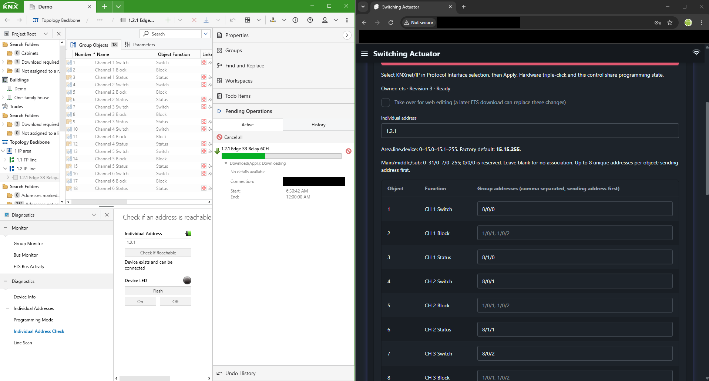
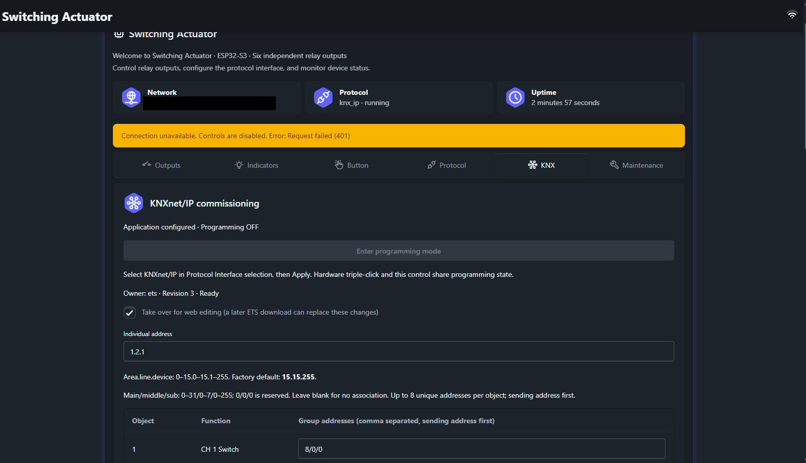

# 啟動入口與 KNX 位址設定

存取 `/` 會轉至 `/device`，安全功能啟用時仍受登入保護。標題及導覽以 Switching Actuator 呈現，`/demo` 保留給明確開啟的範本開發。通訊選擇區名稱為 **Protocol Interface**；先選 KNXnet/IP 並套用，再到 KNX 分頁設定。進入程式設定模式或套用組態皆是主動操作。

## 個別位址 { #individual-address }

`15.15.255 (Factory Default)` 是欄位提示，不會取代現有位址。使用 `area.line.device`，area、line 可為 0–15，device 為 1–255；0 保留給耦合器，此致動器不接受。缺漏、格式錯誤或超出範圍會即時提示。請依拓撲配置唯一位址，瀏覽器無法得知其他裝置是否重複。參考 [KNX 初始位址說明](https://support.knx.org/hc/en-us/articles/360011741860-Multiple-devices-with-the-same-Individual-Address)。

## 群組位址 { #group-addresses }

欄位提示為 `1/0/1, 1/0/2`。只接受三級表示：主群組 0–31、中群組 0–7、子群組 0–255；廣播位址 `0/0/0` 不可建立關聯。逗號分隔的第一個位址用於傳送，空白代表未關聯。每個物件最多八個不重複位址，數值重複、空項及錯誤格式皆拒絕，不支援二級或自由格式。韌體另檢查全域表格上限與擁有權，最終以伺服器驗證為準。參閱 [KNX 位址範圍](https://support.knx.org/hc/en-us/articles/115001825304-Group-Address-Ranges)。

## ETS 下載與網頁擁有權：畫面導讀 { #ets-download-and-web-ownership-screenshot-walkthrough }

這組圖片於 **2026 年 10 月 11 日**加入，內容為英文網頁及 ETS 介面。擷取日期、韌體提交與 ETS 版本未提供；本次未執行下載或變更設定。位址屬於範例現場，不是供直接套用的預設值。

### 擁有權變更前 { #before-the-ownership-change }

三張 KNX 圖片中的私人網路位址及無關瀏覽器書籤已以不透明遮罩遮蔽，設定控制項與結果維持原樣。KNX 個別位址與群組位址保留為通訊協定範例值。

`with_ets_download_before.png` 已有下載/重啟動作，並非下載前閒置畫面。右側為 **Owner: web · Revision 2 · Ready**；ETS 顯示六路 Switch、Block、Status 物件。個別位址為 `1.2.1`，通道 1 可見 Switch `8/0/0`、Status `8/1/0`。ETS 下載期間請勿從網頁編輯。

### 擁有權變更後 { #after-the-ownership-change }

`with_ets_download_after.png` 顯示 **Owner: ets · Revision 3 · Ready**，可見位址與通道 1 關聯未變。然而 ETS 仍為 **Downloading**，檔名與 Ready 並不能證明下載完成。應等候 ETS 最終結果，再讀回位址、關聯及應用參數，保留結果與映像識別供驗收。

### 接管網頁編輯 { #taking-over-for-web-editing }

勾選接管只是要求儲存時轉移擁有權，不會立即生效。後續 ETS 下載仍可能覆蓋網頁修改，因此須同步管理 ETS 專案與本機編輯。

此圖另有 **Connection unavailable. Controls are disabled. Error: Request failed (401)**，是認證失效的例子，不是成功儲存。請重新登入並讀取新快照，離線頁面的殘留資料可能過時。

獲授權的安裝人員或管理員可依序：

1. 等待 ETS 作業結束，確認 KNX 啟用且未下載。
2. 載入目前擁有者與 KNX 修訂號。
3. 勾選 **Take over for web editing**，完成有效修改後執行 **Apply KNX commissioning**。
4. 確認成功回應，讀回已提交設定與 web 擁有權；若有衝突則重新載入並整合修改。

下載期間韌體拒絕網頁儲存，ETS 持有的組態必須明確接管。參閱 [REST 修訂](restfulapi.md#revisions-and-retries)與[驗收程序](commissioning.md)。這些畫面無法證明繼電器動作、完整 ETS 相容性或 KNX 認證。

## 歷史瀏覽器驗證 { #historical-browser-validation }

原變更紀錄中的 HOME-01、KNX-04 涵蓋啟動入口、提示文字、無效邊界、保留/重複位址及有效極值儲存。當時 39 個正式建置 Chromium 案例通過，兩個重點案例在 Chromium、WebKit、行動 Chromium 共六項檢查通過；型別檢查零錯誤警告，建置、排除模擬器標記與格式檢查也通過。這是既有軟體證據，本次未重新執行，且不包含實體 KNX 試運轉。
