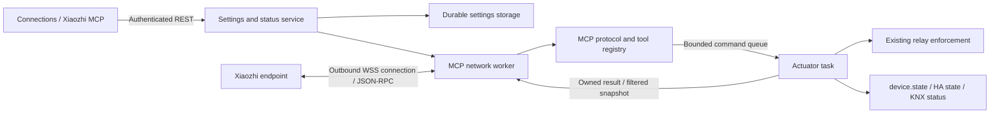

# Xiaozhi MCP integration plan for `dev`

Status: implementation completed in the `dev` working tree; offline validation results are recorded in [the feature documentation](../xiaozhi-mcp.md). Seven firmware configurations pass and their actual images fit their slots. Local C3/Firefox checks hit environment limits; real endpoint and hardware release validation remain outstanding.

Prepared: 2026-10-09 (Asia/Shanghai).

Local baseline: branch `dev`, commit `7fd6d69ce46ed5d1993b9feff164dae61721b21b`.

Reference baseline: `betamoojw/WLED_UserMods`, branch `UserModsDev`, commit `138da958f6d05c2b24fe4a4bfbaede088f32b59b`. Pin review references to this commit because the branch can change.

## 1. Intended outcome and scope

Add an optional Xiaozhi MCP connection to the six-channel switching actuator, covering firmware, configuration persistence, authenticated APIs, frontend navigation and configuration, simulator behavior, localization, builds, tests, and documentation.

The supplied screenshot establishes this navigation placement:

```text
Connections
  MQTT
  NTP
  Xiaozhi MCP       /connections/xiaozhi-mcp
```

An administrator supplies their Xiaozhi MCP endpoint, assigns an alias, selects the permitted relay channels, and enables the connection. Xiaozhi can discover the actuator and invoke explicitly exposed tools. Changes flow through the existing actuator control logic and appear in the device UI and other applicable integrations.

MCP operates alongside MQTT/Home Assistant and the selected Modbus/KNX protocol. It is not another mutually exclusive Protocol Interface mode. Runtime enablement defaults to **off**, with no endpoint or credential supplied by the firmware.

“Across the whole project” means a complete vertical integration. The initial product target is `waveshare-relay-6ch`; other existing board/template builds must remain buildable and accurately report feature availability. Adding relay hardware profiles to unrelated template boards is outside this feature.

The original request authorized research and a saved plan. The subsequent user request authorized implementation according to this plan. It does not supply a cloud endpoint or request operating physical relays, copying vendor credentials, or adopting instructions in the upstream README. In particular, the README's vendor-key/trial setup is reference material, not a requested product requirement.

## 2. What the upstream usermod actually does

Reviewed all seven text files in the Xiaozhi_MCP directory: the four C++ source/header files, README, library manifest, and PlatformIO override.

| Area | Observed behavior | Integration decision |
| --- | --- | --- |
| Transport | Device opens an outbound `ws`/`wss` connection using `WebSocketsClient`; no inbound MCP listener is created. | Preserve the outbound connection model; use verified TLS in production. |
| Protocol role | Device receives JSON-RPC `initialize`, `ping`, `tools/list`, and `tools/call`. It is the MCP tool server even though it is the WebSocket client. | Keep this distinction explicit in naming and tests. |
| Configuration | WLED usermod JSON holds Enabled, Terminal Alias, and MCP Endpoint. Runtime default is disabled; alias defaults to LED. | Replace WLED configuration hooks with project-native services and a Connections page. |
| Lifecycle | Setup waits for network/IP, then initializes the client. The loop retries deferred setup approximately once per minute and services the socket. | Use an explicit lifecycle with prompt network-change handling and bounded retries. |
| Tools | Registers status, alias, power, brightness, RGB, and effect tools. Names end in the first four characters of `getDeviceId()`; descriptions include the alias. | Replace LED behavior with relay/status/identify tools and a longer stable identity. |
| State changes | Handlers mutate WLED globals/segments and call `stateUpdated`. | Use the actuator task and `Actuator::relay`; no direct GPIO writes in MCP callbacks. |
| Status | Adds connection state and alias to WLED's Info JSON. | Add a dedicated status API and page card. |
| MQTT | The `publishMqtt` method is effectively a placeholder. | MCP must work with MQTT disabled. |
| Dependencies | Override requests `links2004/WebSockets@^2.7.2`, plus WLED usermods `License_Mgnt Xiaozhi_MCP`; `library.json` has no dependencies. | Declare a pinned transport dependency in this project's build configuration. Do not import WLED usermod infrastructure. |

Source: [Xiaozhi_MCP.cpp](https://github.com/betamoojw/WLED_UserMods/blob/138da958f6d05c2b24fe4a4bfbaede088f32b59b/usermods/Xiaozhi_MCP/Xiaozhi_MCP.cpp), [WebSocketMCP.cpp](https://github.com/betamoojw/WLED_UserMods/blob/138da958f6d05c2b24fe4a4bfbaede088f32b59b/usermods/Xiaozhi_MCP/WebSocketMCP.cpp), and [build override](https://github.com/betamoojw/WLED_UserMods/blob/138da958f6d05c2b24fe4a4bfbaede088f32b59b/usermods/Xiaozhi_MCP/platformio_override_xiaozhi_mcp.ini).

### Upstream findings to address during adaptation

| Priority | Evidence | Required treatment |
| --- | --- | --- |
| High | `Xiaozhi_MCP.h` contains a token-bearing default endpoint; debug output prints the full URL. | Do not reproduce or use that value. Empty default, write-only credential updates, redacted diagnostics and fixtures. |
| High | `beginSSL` is called without explicit CA/bundle configuration in the wrapper. | Configure chain and hostname verification explicitly; prove invalid certificates fail. Do not infer security from the `wss` prefix. |
| High | WLED callbacks directly mutate state. Current actuator state belongs to a separate task. | Add a bounded, owned command bridge; never mutate actuator state on the network task. |
| Medium | `handleReconnect` increases a backoff counter but only logs it; library automatic reconnect drives actual attempts. | One owner controls real connection attempts; measured retry timing must match status. |
| Medium | `enableHeartbeat(PING_INTERVAL, PING_INTERVAL, DISCONNECT_TIMEOUT)` passes 60000 as the third parameter. That API expects a `uint8_t` missed-pong count, not milliseconds. | Specify interval, pong timeout, and failure count separately. Header comments also disagree with the actual 10-second ping constant. |
| Medium | Received text is converted from a pointer without using callback `length`; fragment events are ignored. | Bound length, assemble fragments safely, reject oversized messages, and clear partial messages on disconnect. |
| Medium | Some replies concatenate JSON and stringify IDs; tool calls coerce IDs to `int`. | Preserve JSON-RPC ID type/value and serialize with ArduinoJson. Test string IDs and escaping. |
| Medium | Parse errors and unsupported methods are silently ignored; advertised prompts/resources have no handlers. | Return appropriate protocol errors and advertise only supported capabilities. |
| Medium | Initialization replies advertise `2024-11-05`, then the device sends `notifications/initialized`. | Receive the client's initialized notification; verify actual Xiaozhi behavior before adding any narrowly scoped compatibility exception. |
| Medium | Updating WLED config does not explicitly restart/reconfigure the socket; disabling merely exits the loop. Re-registering an existing tool changes only its callback. | Stop/reconfigure deliberately; rebuild alias-dependent metadata on changes and reconnect. |
| Medium | Four-character identity suffix and manually concatenated descriptions can cause name collisions or invalid JSON. | Use the full stable device identifier and JSON serialization. |

These findings are source review results, not a claim that upstream hardware was tested. References: [upstream header](https://github.com/betamoojw/WLED_UserMods/blob/138da958f6d05c2b24fe4a4bfbaede088f32b59b/usermods/Xiaozhi_MCP/Xiaozhi_MCP.h), [WebSocket wrapper header](https://github.com/betamoojw/WLED_UserMods/blob/138da958f6d05c2b24fe4a4bfbaede088f32b59b/usermods/Xiaozhi_MCP/WebSocketMCP.h), [WebSockets 2.7.2 API](https://github.com/Links2004/arduinoWebSockets/blob/2.7.2/src/WebSocketsClient.h), and [MCP lifecycle](https://modelcontextprotocol.io/specification/2024-11-05/basic/lifecycle).

The upstream repository declares EUPL-1.2-or-later; its README attributes the wrapper to a separate Xiaozhi MCP library. Record provenance and applicable notices before reusing source. Prefer a small project-native implementation informed by the reviewed behavior; do not assume the repository license settles all third-party provenance. See [upstream license](https://github.com/betamoojw/WLED_UserMods/blob/138da958f6d05c2b24fe4a4bfbaede088f32b59b/LICENSE) and [README](https://github.com/betamoojw/WLED_UserMods/blob/138da958f6d05c2b24fe4a4bfbaede088f32b59b/usermods/Xiaozhi_MCP/readme.md).

## 3. Current project integration points

Paths below are repository-relative and were inspected at the local baseline.

| Existing code | Relevant constraint |
| --- | --- |
| `src/main.cpp` | Framework starts before `device.begin()`. Arduino `loop()` deletes its own task; MCP cannot rely on adding work there. Actuator HTTP server currently reserves 160 handlers. |
| `lib/framework/ESP32SvelteKit.{h,cpp}` | Owns framework services and its network/core-0 task. Generic transport and settings should be integrated here with feature guards. |
| `lib/framework/{MqttSettingsService,NTPSettingsService}.*`, `MqttStatus.*` | Established configuration/status route patterns. Default settings endpoint authorization is admin. |
| `lib/framework/{HttpEndpoint,FSPersistence}.h` | Generic endpoint/persistence callbacks do not make save failure a transactional HTTP failure; do not blindly copy this for credentials. Use separate public and persisted serialization. |
| `src/device/DurableStore.h` | Verified two-generation storage can preserve the previous valid configuration on failed writes. |
| `lib/framework/NetworkSupport.h` | Authoritative IPv4 uplink/IP/interface view; deliberately excludes provisioning AP. Reuse for WiFi/Ethernet transitions. |
| `src/device/Actuator.{h,cpp}` | Owns the mutex, eight-entry request queue, relay enforcement, pulse expiry, disconnect policy, audit buffer, and periodic `device.state` publication. |
| `src/device/ActuatorApi.cpp` | HTTP commands are authenticated and queued; execution checks channel mask, disabled/blocked outputs, and request deduplication. Relay origins currently use literal `web`. |
| `src/device/HomeAssistant.{h,cpp}` | Useful example of queued external commands and state synchronization, but not a dependency of MCP. |
| `lib/framework/Features{,Service}.{h,cpp}`, `features.ini`, `platformio.ini` | Compile flags and `/rest/features` govern frontend availability. Default product target is Waveshare; generic builds exclude `device/` and `protocols/`. |
| `interface/src/routes/menu.svelte` | Connections currently appears only when MQTT or NTP is available. Its submenu must gain a third sibling. |
| `interface/src/routes/connections/{mqtt,ntp}/` | Existing page/title/card conventions. The parent `/connections` route currently goes to `/`. |
| `interface/src/lib/types/models.ts`, `routes/+layout.ts` | Wire types and initial feature discovery. |
| `interface/src/lib/i18n/{translations.tsv,messages.json}` | Seven languages, with generated messages from TSV. Existing themes are Light, Dark, Nord, Dim, and Sepia. |
| `interface/simulator/{profiles,framework,device,server,persistence}.mjs` | Source-derived firmware API simulation, deterministic runtime controls, persistence and reset. |
| `interface/tests/`, `scripts/test_native.py`, `scripts/test_home_assistant.py` | Existing browser, contract, simulator and production-C++ testing patterns. |

The existing browser EventSocket and `WebSocketServer.h` are inbound browser facilities. `WebSocketClient.bak` is an inactive experimental file, not an available production MCP client. Neither is a drop-in implementation.

## 4. Proposed architecture



### Ownership and lifecycle

1. Add framework-owned `XiaozhiMcpSettingsService`, `XiaozhiMcpStatus`, and `XiaozhiMcpService`, guarded by `FT_XIAOZHI_MCP`. Keep protocol parsing independent from transport and board hardware.
2. Add `src/device/XiaozhiMcpAdapter.{h,cpp}` to define actuator tools and attach the actuator command bridge. Framework startup may load settings/register routes, but outbound connection waits for tool-provider registration after actuator initialization.
3. Run WebSocket/DNS/TLS work in a dedicated worker task, outside both the actuator critical section and the shared framework loop. Only this worker touches the socket. UI/API updates pass immutable settings snapshots with a generation counter to it.
4. Reuse or factor the actuator request queue into a public, typed submission boundary with explicit origin/principal, allowed operations, channel mask, deadline and owned result. Preserve HTTP behavior and defaults. Never pass stack-owned requests across tasks or hold the actuator mutex while waiting for network I/O.
5. Commands are executed by the actuator task. Status snapshots use that ownership boundary or a short locked snapshot API. A copied snapshot is serialized/sent after releasing the lock.
6. Disable/reconfigure/network loss increments a session/settings generation, closes the transport and invalidates stale queued commands/results. Recheck generation, enabled state and channel policy at execution time. Expired queued commands must not execute later after a reported timeout.
7. Integrate OTA start/failure/completion, restart, factory reset and sleep lifecycle hooks. Existing `FirmwareUpdateEvents.h` describes frontend events, not a complete internal lifecycle callback system; add the necessary internal hook rather than depending on browser messages. Pause MCP and release TLS resources during OTA; resume after failed OTA when appropriate.

### Transport and runtime state

Initial transport candidate: pin `links2004/WebSockets` to `2.7.2`, matching the reviewed upstream API, behind an adapter. Its API includes `beginSslWithBundle`; prove compatibility with the project's Arduino-ESP32 3.3.12 platform and embedded certificate bundle before adopting it. If its memory/blocking characteristics fail the spike, evaluate an explicitly packaged ESP-IDF WebSocket client; do not assume the component is bundled because the `.bak` file includes it.

Use these observable states: `disabled`, `unconfigured`, `waiting_network`, `waiting_time`, `connecting`, `initializing`, `ready`, `backoff`, `error`, `paused`. `connected` means transport connected; `ready` additionally means protocol initialization completed. Connecting and initialization have deadlines.

Reconnect uses one actual scheduler with jittered exponential delays from 1 to 60 seconds. Reset the backoff after a stable ready session. Network/IP/interface changes trigger a clean restart through `NetworkSupport`; AP-only mode cannot start the connection. Authentication/configuration failures expose a useful redacted reason and avoid rapid retry loops. WebSocket ping/pong and MCP JSON-RPC ping are separate mechanisms.

Production accepts `wss://` with certificate and hostname verification. Validate scheme, host, port, path and length; reject userinfo, fragments, malformed URLs and control characters. Preserve the supplied path/query for the connection. Use the existing embedded trust bundle; verify the required trust root is actually present. Wait for plausible system time without blocking startup or automatically changing the user's NTP settings. For this release, enabled product builds require `FT_NTP=1`; runtime NTP off with no valid clock yields `waiting_time` and guidance linking to NTP. Plain `ws://` is allowed only in an explicit test build, not a production setting.

Provisional resource limits to measure in the spike: 2 KiB endpoint, 64 UTF-8 bytes alias, 8 KiB inbound frame/message, nesting depth 8, 16 KiB outbound response, four pending MCP commands, 10 commands/second with a burst of four, and a two-second command deadline. Bound ArduinoJson allocation as well as input size. Give other actuator command sources fair queue access. Document final heap, stack, firmware-size and latency measurements before freezing limits.

## 5. Settings, persistence, permissions and API contract

### Stored configuration

| Field | Proposed meaning/default |
| --- | --- |
| `schema_version` | `1`; reject unsupported future schemas without overwriting them. |
| `revision` | Monotonically increasing settings revision for concurrent-edit detection. |
| `enabled` | `false`. |
| `alias` | `Switching Actuator`; trimmed, 1–64 UTF-8 bytes when enabling. |
| `endpoint` | Empty initially; full token-bearing endpoint is a secret. |
| `channel_mask` | `0` initially; administrator explicitly selects channels to expose, bits 0–5. Zero allows status/alias/identify only. |

Use a separate configuration record, not the Modbus/KNX `DeviceConfig` schema. Persist under flat `/config/xiaozhiMcp.0` and `.1` slots using `DurableStore`. To make this available to the framework, move the helper to `lib/framework/DurableStore.h` and retain a forwarding include at its old path; run the existing storage tests unchanged plus the new service tests. Serialize settings updates, validate a complete candidate, write and verify it, then commit runtime state. A failed write returns an error and leaves the previous active configuration intact. A no-op save does not write flash or reconnect.

Maintain distinct `readPublic` and `writePersisted` serializers. No GET, event, tool result, log or error may return the secret endpoint. Persisted settings are not encrypted by this design; redaction is an API/log property, not an at-rest encryption claim. Block static serving of the MCP configuration: the existing `SERVE_CONFIG_FILES` debug option exposes `/config/`, so reject its combination with MCP at build time or explicitly deny the new secret files before any generic static handler.

Factory reset must quiesce writers, erase both slots and any pending state, and return to disabled/unconfigured. Upgrade from existing firmware creates no active connection. Downgrading firmware may leave ignored files; returning to MCP-capable firmware reloads a supported record. Document this and provide explicit credential removal.

### REST surface

| Route | Access | Contract |
| --- | --- | --- |
| `GET /rest/xiaozhiMcpSettings` | Admin | Public fields, `endpoint_configured`, safe `endpoint_host`; never full endpoint. |
| `POST /rest/xiaozhiMcpSettings` | Admin | Complete editable fields and expected `revision`; optional write-only `endpoint` and explicit `clear_endpoint`. Returns redacted committed settings. |
| `GET /rest/xiaozhiMcpStatus` | Authenticated | Runtime state, transport/ready flags, alias, stable device ID, interface, tool count, retry delay, uptime-based connection times, and sanitized error code/message. |
| `GET /rest/xiaozhiMcpTools` | Admin | Exact registered names, descriptions, schemas and exposure policy for the tools preview. |
| `POST /rest/xiaozhiMcpReconnect` | Admin | Queues reconnect using saved settings; rejects if disabled/unconfigured. Never sends a relay command. |

Endpoint edit rules: omitted or empty `endpoint` preserves the stored secret; a nonempty endpoint replaces it. Only `clear_endpoint: true` removes it, and clearing while enabled is invalid unless the same save disables the service. Reject contradictory clear/replace input. Validate body types/size, UTF-8 byte limits, mask range and unknown editable fields; validation errors identify fields without echoing endpoint content. Require a configured endpoint before enabling.

HTTP outcomes: `400` malformed JSON/body, `401` unauthenticated, `403` unauthorized, `409` stale revision or invalid reconnect state, `422` field validation failure, `503` storage/queue/service unavailable, and `200` committed settings/read responses. Reconnect may use `202` with an operation acknowledgement. Define these in firmware, TypeScript types and simulator together. Configuration success means persisted; it does not imply cloud readiness.

Use the project's admin predicate for connection management. Installer/operator/viewer users see sanitized status only, with no settings request or editable controls. Cloud commands execute as a restricted `xiaozhi_mcp` integration principal with the configured mask; an endpoint token is not a local admin JWT. Keep production MCP unavailable in `FT_SECURITY=0` builds unless a separately reviewed development override is deliberately added; the standard security-off simulator profile reports the feature unavailable.

## 6. MCP protocol and actuator tools

Support `initialize`, `notifications/initialized`, `ping`, `tools/list`, and `tools/call`. Initially implement the upstream's `2024-11-05` version and explicitly negotiate it; do not claim support for newer versions without implementing/testing their requirements. Return server identity for this product and advertise only tools. Preserve string/integer request IDs, never reply to notifications, and prevent no-ID tool messages from causing mutations. Validate the envelope and schema before dispatch. Use protocol errors for malformed JSON, invalid requests/arguments, and unknown methods/tools; use a tool result with `isError: true` for blocked/disabled channels, busy queues or execution failures. See [MCP tools](https://modelcontextprotocol.io/specification/2024-11-05/server/tools).

A small fixed registry fits one `tools/list` response; reject unsupported nonempty pagination cursors explicitly. Rebuild descriptions after alias/policy changes and reconnect so clients discover the new list. Use `tools.listChanged: false` initially. Treat a transport connection as uninitialized until the handshake succeeds; test the real Xiaozhi handshake before finalizing compatibility behavior.

Use `SettingValue::format("#{unique_id}")` or its underlying stable station-MAC identity for an interface-independent, full identifier; validate its exact format in the spike. Tool names contain a sanitized stable suffix, never a user alias. Alias and channel labels belong in descriptions and text results, serialized safely. UI language changes must not change machine tool names or argument values.

| Proposed tool | Input | Action/result |
| --- | --- | --- |
| `actuator_status_<id>` | Empty object | Filtered device summary, exposed channel numbers/names/states/enabled/blocked flags, active protocol and relevant fault. Exclude audit/user/network secrets and unexposed channels. |
| `actuator_get_alias_<id>` | Empty object | Alias and stable device identity. |
| `actuator_set_relay_<id>` | `channel`: integer 1–6; `on`: boolean | Translate once to internal index 0–5; execute through existing relay rules and return applied state. |
| `actuator_pulse_relay_<id>` | `channel`: integer 1–6; `request_id`: bounded string | Pulse for that channel's configured duration; no cloud override of duration. Deduplicate explicit operation ID and report applied state/duration. |
| `actuator_all_off_<id>` | Empty object | Turn off exposed enabled channels; preflight all affected channels and reject if any is blocked. Never alter unexposed channels. |
| `actuator_identify_<id>` | Empty object | Invoke existing bounded identify behavior; report when indication is unavailable because RGB is disabled. |

Mutation tools are absent when their policy allows no channels, except the separately bounded identify tool. Enforce the current policy again at execution even if a caller cached an older tool list. Preserve existing blocked-channel behavior, including for off commands; cloud control cannot unblock a channel. Do not expose factory reset, OTA, credential management, network settings, KNX programming, protocol switching or unrestricted GPIO access.

The current HTTP `all_off` implementation requires permission for every enabled channel. Do not forward an MCP subset operation to it unchanged or loosen the HTTP rule globally. Add an explicit internal subset operation that preflights and applies only the configured MCP mask under the actuator lock; keep existing HTTP bulk semantics intact.

Set command source to `xiaozhi_mcp`, audit operation/channel/result without secrets, and use the existing state/publication path so the browser, MQTT Home Assistant state and KNX status stay consistent. Keep existing protocol watchdog/disconnect policies; a cloud disconnect by itself does not create a new all-off policy. Verify control when Protocol Interface is Off and alongside each active protocol mode.

Within a connection, cache completed request IDs plus argument fingerprints; duplicate IDs with changed arguments are rejected. For pulses also cache the explicit `request_id` across transient reconnects for a documented bounded interval (initially 60 seconds). Queued work is canceled on generation changes. Do not automatically replay mutations after reconnect and do not promise exactly-once behavior across reboot. Tests must distinguish expired-before-execution from a command already applied whose response could not be delivered.

WLED brightness, LED-strip RGB/effects and power semantics do not describe this actuator's relay outputs. They are intentionally replaced by the tools above. The onboard RGB indicator remains covered by identify; broader indicator/tone tools can be a later extension.

## 7. Frontend design and behavior

Create `interface/src/routes/connections/xiaozhi-mcp/{+page.ts,+page.svelte,XiaozhiMCP.svelte}` with title `Xiaozhi MCP`, using existing Svelte 5, SettingsCard, input, notification and theme conventions.

1. Add Xiaozhi MCP after NTP in `menu.svelte`. Connections visibility becomes `mqtt || ntp || xiaozhi_mcp`. Confirm MCP-only availability still shows the group. Preserve the current parent-route redirect unless a separate UX change is requested.
2. Gate direct route rendering by feature availability, including older firmware that omits the feature key. Unsupported pages show an unavailable state and do not fetch nonexistent endpoints.
3. Display a status card: Disabled, Not configured, Waiting for network/time, Connecting, Initializing, Ready, Retrying, Error, Paused. Use text as well as color; distinguish saved settings from connection success.
4. Admin settings card: Enable, Alias, password-style MCP endpoint entry, configured/replace/remove state, and six allowed-channel checkboxes using existing channel names. Include concise copy explaining that selected channels become available to Xiaozhi. Do not prefill a real token or store it in browser persistence.
5. Apply Settings validates and saves; keep drafts on failure, handle revision conflicts without overwriting newer values, and clear endpoint input after success. Reconnect uses committed settings and is disabled while unsaved changes would make its effect ambiguous. Disabling preserves the endpoint for later use; explicit removal clears it.
6. Admin tools card shows the exact tools and argument summaries. It is a preview; do not add a hidden test action that toggles physical outputs. Non-admin users receive a read-only status view.
7. Poll status every 2–5 seconds while mounted/visible, with an immediate refresh after save/reconnect. Abort requests and remove timers on navigation/logout; pause while hidden. A new EventSocket channel is not required for v1; existing `device.state` continues updating relay views.
8. Add explicit TypeScript models for settings read/write, status, tools and errors. Translate display strings, status/error codes and validation text in all seven locales; regenerate `messages.json`. Preserve aliases, endpoint input and tool identifiers exactly.
9. Verify mobile drawer navigation, keyboard focus, labels, password visibility control, long Unicode aliases/errors and all themes. Render descriptions as text, never raw HTML. Status refresh must not overwrite an in-progress form.

## 8. Build, simulation and repository file map

| Files | Planned change |
| --- | --- |
| `lib/framework/Features.h`, `FeaturesService.cpp`, `features.ini`, `platformio.ini` | Define `FT_XIAOZHI_MCP`; default off generically, on for the actuator product build, runtime disabled. Expose `xiaozhi_mcp` accurately. Guard NTP/security requirements and transport includes/dependencies. |
| `factory_settings.ini` | Document empty/disabled defaults; never include a service credential in build flags. |
| New `lib/framework/XiaozhiMcpSettingsService.{h,cpp}`, `XiaozhiMcpStatus.{h,cpp}`, `XiaozhiMcpService.{h,cpp}` | Public settings/status APIs, durable configuration, worker lifecycle and connection management. |
| New `lib/framework/XiaozhiMcpProtocol.{h,cpp}`, `XiaozhiMcpTransport.{h,cpp}` | Bounded JSON-RPC dispatch/tool registry and transport adapter. |
| `lib/framework/ESP32SvelteKit.{h,cpp}` | Service ownership/getters, startup, feature reporting and shutdown hooks. Recheck handler capacity after route registration. |
| `lib/framework/DurableStore.h`, `src/device/DurableStore.h` | Relocate reusable implementation with compatibility forwarding header. |
| `src/device/XiaozhiMcpAdapter.{h,cpp}`, `Actuator.{h,cpp}`, `ActuatorApi.cpp` | Tool provider, owned command bridge, origin/policy handling, filtered snapshots and reset coordination. |
| `lib/framework/{UploadFirmwareService,DownloadFirmwareService,RestartService,SleepService}.*` | Internal lifecycle notifications where required; avoid browser-dependent shutdown. |
| `interface/src/routes/menu.svelte`, new route, `lib/types/models.ts`, i18n catalogs | Navigation, forms, status/tools and translations. |
| `interface/simulator/{profiles,framework,device,server,persistence}.mjs` | Feature fixtures, redacted settings semantics, revision/storage errors, deterministic connection states, reset and policy simulation. |
| New `interface/simulator/xiaozhi-mcp.mjs` | Keep MCP-specific validation/runtime simulation isolated from generic MQTT/NTP normalization. |
| New `tests/xiaozhi_mcp_tests.cpp`, transport/actuator stubs, `scripts/test_xiaozhi_mcp.py` | Exercise production C++ parser/service/adapter with fake transport, clock, storage and actuator boundary. |
| `interface/tests/simulator/`, `tests/e2e/`, `tests/contracts/README.md`, `scripts/capture-contract.mjs` | API parity, navigation/roles/errors/reload, redacted read-only capture and contract authority. |
| `.github/workflows/frontend-tests.yml`, new firmware/native workflow as needed | Run MCP regressions on `dev` and PRs; existing frontend workflow alone does not build/test firmware. |
| `README.md`, `CHANGELOG.md`, `mkdocs.yml`, new `docs/xiaozhi-mcp.md`, existing testing/build docs | Setup, API/tool reference, scope, troubleshooting, validation evidence and release notes. |

The UI simulator must never open a real Xiaozhi connection. Add deterministic controls for connection loss, auth failure, invalid time, ready, command rejection and reconnect. Add disabled/MCP-only/combined feature cases. Include saved settings migration for existing simulator state files. A separate local mock WSS endpoint tests the real firmware transport; passing frontend simulation is not evidence of cloud interoperability.

## 9. Ordered implementation milestones

### M1 — Contracts and transport proof

- [x] Freeze API/tool names, settings/public-secret separation, policy and error semantics above.
- [ ] Verify dependency/API compatibility, certificate bundle verification, heap/stack use and task latency on the current platform.
- [ ] Capture a sanitized local mock handshake and, when a user-provided endpoint and test board are available, a real Xiaozhi handshake/tool listing. Never use the upstream embedded endpoint.
- [x] Record any protocol compatibility deviation and third-party provenance before source reuse.

Exit: reproducible transport build, rejected invalid certificate, validated handshake strategy and measured resource budget. A missing live endpoint blocks final interoperability evidence, not offline implementation.

### M2 — Feature, persistence and service APIs

- [x] Add compile/availability flags and framework service ownership.
- [x] Implement validated, revisioned, durable configuration with distinct redacted/public serialization.
- [x] Add authenticated settings/status/tools/reconnect routes and lifecycle state machine.
- [x] Add startup/reconfiguration/network/time/reset/OTA handling and tests.

Exit: no connection by default; settings survive reboot, failures preserve prior state, secrets never appear in public responses, and feature-off builds remain valid.

### M3 — MCP engine and actuator bridge

- [x] Implement bounded parsing, protocol negotiation, tool listing/calls and structured errors.
- [x] Add task-owned command bridge, exposure mask, stale-work cancellation, command-origin reporting and deduplication.
- [ ] Implement the six tools and validate shared behavior against existing HTTP/Home Assistant/KNX paths.

Exit: production C++ tests prove permitted commands apply, disallowed commands do not, pulse retries do not repulse within the supported window, and reconnect cannot replay stale commands.

### M4 — Connections UI and simulator

- [x] Add the sibling navigation entry and guarded route with status/settings/tools cards.
- [x] Implement secret replacement/removal, non-admin view, async state/error handling and timer cleanup.
- [x] Add simulator parity, deterministic failure controls, translations and browser tests.

Exit: end-to-end setup/reload/disable/reconnect flows work in simulator with all roles, feature combinations and supported themes/locales.

### M5 — Integrated validation and release documentation

- [ ] Run native, simulator, browser, bundle and firmware build matrices.
- [ ] Exercise mock WSS and an isolated physical board with a user-provided Xiaozhi endpoint.
- [ ] Run coexistence, reconnection, OTA/reset and soak checks; record resource/latency deltas.
- [x] Publish setup/troubleshooting documentation and record verified versus outstanding hardware checks.

Exit: all acceptance criteria below are satisfied or explicitly recorded as unresolved release blockers. Do not claim cloud or hardware validation from mocks.

### Implementation record (2026-10-09)

M2–M4 are implemented in the `dev` working tree. The framework owns
`XiaozhiMcpService`, with separate portable protocol/settings and WSS transport
modules. The actuator owns a bounded command adapter and pulse retry cache.
Settings, status and reconnect endpoints are consolidated in the service rather
than split into the originally suggested classes. No upstream source, credential
or trial/licensing logic is copied.

The Connections page, simulator, translations, native tests and CI build profiles
are present. [Feature documentation](../xiaozhi-mcp.md) records setup, API behavior,
limits and actual validation results. The checklists above retain the full design
and release criteria: hardware execution, live Xiaozhi interoperability, real TLS
rejection, queue timing under load and endurance measurements remain unverified.

## 10. Validation plan

| Layer | Required evidence |
| --- | --- |
| Production C++ protocol | Integer/string IDs; escaped/Unicode aliases; malformed/deep/large JSON; fragmented text; unknown methods/tools; notifications; handshake ordering/version mismatch; schema validation; bounded allocation/send failure. |
| Settings and lifecycle | Omitted/empty/replace/clear endpoint semantics; stale revision; torn write/storage failure; schema mismatch; missing configuration; disable while connecting; endpoint change; stale queue cancellation; network/IP change; invalid time; backoff timing and timer wraparound. |
| Actuator adapter | 1-based to 0-based conversion; strict booleans and bounds; all six channels; disabled/blocked/masked rejection; bulk preflight; pulse expiry/deduplication; queue pressure/deadline; source/audit; state sync; no config/admin tools. |
| API/security | Unauthenticated 401; non-admin settings/reconnect denial; sanitized status; no token in responses/logs/errors/capture; feature-off route behavior; static-file guard; no real credentials in fixtures/build artifacts. |
| Frontend/simulator | Connections order/active state/mobile; MCP-only group; unsupported direct route; dirty form; failed/stale save; disabled/unconfigured/waiting/ready/error; secret retention/removal; reload/reboot/reset; polling cleanup; seven languages/five themes. |
| Network integration | Local mock WSS initialization/tool calls; valid/invalid certificates and hostname; DNS failure; close/auth failure; missing pong; fragmentation; WiFi/Ethernet transition where hardware supports it. |
| Hardware/coexistence | HTTP UI responsiveness, button response and pulse timing during TLS/retries; MQTT/HA updates; Modbus RTU/TCP and KNX modes individually with MCP; network disconnect policy; OTA failure/recovery; reset credential erasure. |
| Endurance | Initial target: 24-hour run and at least 100 disconnect/reconnect cycles, including commands during transitions; no crashes, monotonic heap loss, unintended relay changes or stale command execution. Record peak TLS heap and task stack margin. |

Run existing checks at implementation time from the indicated directories:

```powershell
# Repository root
python scripts/test_native.py
python scripts/test_home_assistant.py
python scripts/test_xiaozhi_mcp.py  # New test runner added by this feature
pio run -e waveshare-relay-6ch -e esp32-s3-devkitc-1 -e Kincony-B16M

# interface/
npm run i18n:build
npm run test:i18n
npm run check
npm run build
npm run test:bundle
npm run test:sim
npm run test:e2e
npm run test:e2e:built
```

Use the repository's configured PlatformIO installation if `pio` is not on PATH. Add explicit test environments/overrides for actuator MCP on/off and MCP on with MQTT off, plus negative configuration checks for unsupported NTP/security combinations. Smoke-build the remaining existing board environments with MCP off. Do not edit real user credentials or energize connected loads as part of automated browser checks.

The bundle check currently checks test-marker leakage, not a firmware-size budget. Record frontend gzip size and firmware flash/partition headroom separately. If build manifests are regenerated, retain truthful hardware-test fields and record the tested commit/configuration.

## 11. Acceptance criteria and remaining uncertainties

- [ ] On supported firmware, **Connections → Xiaozhi MCP** sits beside MQTT and NTP, including on mobile.
- [ ] Feature-unavailable firmware hides the menu item and the route fails gracefully; runtime-disabled firmware still exposes the configuration page.
- [ ] Admin can configure, persist, replace/remove the endpoint, enable/disable and reconnect without reboot; non-admin access matches the API contract.
- [ ] A freshly flashed/upgraded device has no active cloud connection and no bundled endpoint credential.
- [ ] Ready means a completed MCP handshake. Disconnection, time/TLS/auth failures and retries are distinguishable and actionable without disclosing secrets.
- [ ] Xiaozhi discovers stable actuator tools and controls only exposed, enabled, unblocked relays through the actuator task; state is consistent in the local UI and applicable integrations.
- [ ] Pulse/bulk operations satisfy the defined retry/atomicity rules; stale queued work is rejected on disable, reconfigure and disconnect.
- [ ] MQTT independence, Modbus/KNX coexistence, factory reset, OTA, localization, simulator parity and build flags have direct test coverage.
- [ ] Real endpoint interoperability and hardware latency/resource tests are recorded before feature release.

Uncertainties to resolve in M1/M5: the live Xiaozhi service's current initialization/version behavior, certificate chain coverage in the filtered bundle, exact transport resource cost on this build, appropriate final queue/message limits, and source provenance if any wrapper code is reused. The current review did not use a service token, contact the Xiaozhi endpoint, compile new firmware, or operate hardware. These are implementation validation tasks, not assumptions of success.

## 12. Review references

- [Requested upstream directory](https://github.com/betamoojw/WLED_UserMods/tree/UserModsDev/usermods/Xiaozhi_MCP)
- [Pinned upstream directory](https://github.com/betamoojw/WLED_UserMods/tree/138da958f6d05c2b24fe4a4bfbaede088f32b59b/usermods/Xiaozhi_MCP)
- [MCP 2024-11-05 lifecycle](https://modelcontextprotocol.io/specification/2024-11-05/basic/lifecycle)
- [MCP 2024-11-05 tools](https://modelcontextprotocol.io/specification/2024-11-05/server/tools)
- [WebSockets 2.7.2 client API](https://github.com/Links2004/arduinoWebSockets/blob/2.7.2/src/WebSocketsClient.h)
- Local architecture: [actuator implementation](../actuator-implementation.md), [network migration](../network-api-migration.md), [frontend testing](../frontend-testing.md), [Home Assistant](../home-assistant.md), [UI preferences](../ui-preferences.md).
